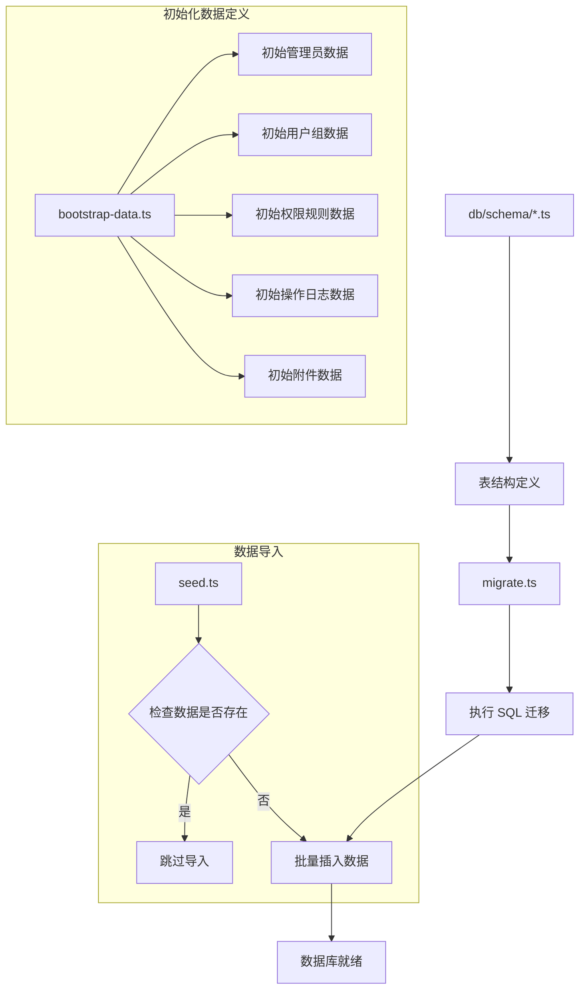
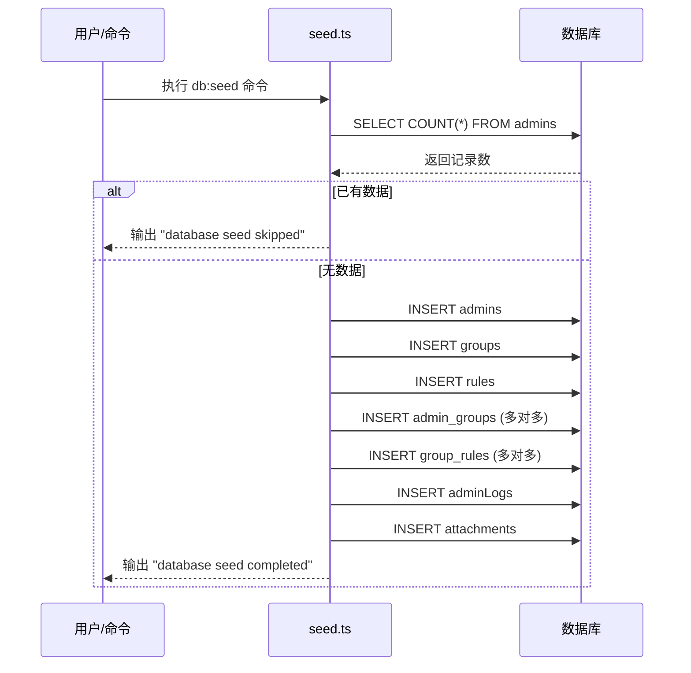

本页面详细介绍 Admin Air 项目中数据库初始化与种子数据的完整机制。该系统采用 **Drizzle ORM** 作为数据层，通过声明式的 Schema 定义与自动化的 Seed 流程，确保开发环境快速就绪。

---

## 架构概览

Admin Air 的数据初始化采用 **分层架构**，将初始数据定义与执行逻辑分离。数据初始化流程包含三个核心阶段：Schema 定义 → 数据库迁移 → 种子数据导入。



**关键设计原则**：所有 Seed 操作具有 **幂等性**（Idempotent），重复执行不会导致数据重复或错误，这通过检查 `admins` 表是否存在数据来实现。

Sources: [seed.ts](server/src/db/seed.ts#L8-L10), [bootstrap-data.ts](server/src/bootstrap/bootstrap-data.ts#L117-L148)

---

## 核心组件

### 数据定义层：bootstrap-data.ts

`bootstrap-data.ts` 是整个系统的核心，定义了所有初始数据的类型接口与实际数据。该文件位置为 `server/src/bootstrap/bootstrap-data.ts`，包含以下关键导出：

| 导出名称 | 数据类型 | 数据用途 |
|---------|---------|---------|
| `initialAdmins` | `BootstrapAdmin[]` | 初始管理员账户 |
| `initialGroups` | `BootstrapGroup[]` | 初始用户组 |
| `initialRules` | `BootstrapRule[]` | 初始权限规则（菜单+按钮） |
| `initialAdminLogs` | `BootstrapAdminLog[]` | 初始操作日志 |
| `initialAttachments` | `BootstrapAttachment[]` | 初始附件（头像） |
| `siteConfig` | `object` | 站点配置参数 |
| `layoutDefaults` | `object` | 前端布局默认参数 |

Sources: [bootstrap-data.ts](server/src/bootstrap/bootstrap-data.ts#L1-L115)

#### 管理员数据结构

```typescript
export interface BootstrapAdmin {
    id: number
    username: string
    nickname: string
    avatar: string
    email: string
    mobile: string
    motto: string
    password: string              // 明文密码，Seed 时自动加密
    group_arr: number[]           // 关联的用户组 ID 数组
    status: 'enable' | 'disable'
    last_login_time: string
    create_time: string
    super: boolean                // 是否为超级管理员
}
```

系统预设两名管理员：

| 用户名 | 角色 | 密码 | 所属组 |
|--------|------|------|--------|
| `admin` | 系统超级管理员 | `AdminAir_2026` | 超级管理员组 |
| `editor` | 内容管理员 | `EditorAir_2026` | 内容管理员组 |

Sources: [bootstrap-data.ts](server/src/bootstrap/bootstrap-data.ts#L117-L148)

#### 权限规则类型

权限规则采用树形结构设计，支持三种类型：

| 类型值 | 说明 | 典型用途 |
|--------|------|---------|
| `menu_dir` | 菜单目录 | 一级导航菜单（如"权限管理"） |
| `menu` | 菜单项 | 具体功能页面（如"管理员管理"） |
| `button` | 按钮权限 | 操作按钮（如"新增"、"编辑"、"删除"） |

每个规则包含完整的导航信息：`path`（路由路径）、`component`（前端组件路径）、`icon`（图标）、`menu_type`（标签页/iframe/链接）以及 `keepalive`（是否缓存）等。

Sources: [bootstrap-data.ts](server/src/bootstrap/bootstrap-data.ts#L1-L22), [bootstrap-data.ts](server/src/bootstrap/bootstrap-data.ts#L171-L265)

---

### 执行层：seed.ts

`seed.ts` 负责将定义层的初始数据实际导入数据库，位置为 `server/src/db/seed.ts`。

#### 执行流程



#### 关键代码逻辑

1. **幂等性检查**：通过 `count()` 查询 `admins` 表，若存在记录则直接返回 `false` 跳过导入
   
2. **密码加密转换**：原始密码通过 `hashPassword()` 函数使用 **scrypt** 算法加密存储
   
3. **多对多关系处理**：管理员-用户组、用户组-规则的关系通过中间表 `admin_groups` 和 `groupRules` 维护，使用 `flatMap` 展平数组后批量插入

```typescript
// 管理员与用户组的多对多关系
await db.insert(adminGroups).values(
    initialAdmins.flatMap((item) => 
        item.group_arr.map((groupId) => ({ adminId: item.id, groupId }))
    )
)

// 用户组与权限规则的多对多关系
await db.insert(groupRules).values(
    initialGroups.flatMap((item) => 
        item.rules.map((ruleId) => ({ groupId: item.id, ruleId }))
    )
)
```

Sources: [seed.ts](server/src/db/seed.ts#L1-L114)

---

## 密码安全机制

系统使用 Node.js 原生 **crypto** 模块实现密码 hashing，算法参数如下：

| 参数 | 值 | 说明 |
|------|-----|------|
| 算法 | scrypt | 基于密码的密钥派生函数（KDF） |
| 盐长度 | 16 字节 | 随机生成，每次加密不同 |
| 密钥长度 | 64 字符 | 输出为 32 字节的十六进制字符串 |
| 安全特性 | timingSafeEqual | 防止时序攻击 |

密码存储格式为 `salt:hash`，例如：`a1b2c3d4e5f6...:8f7e6d5c4b3a...`

Sources: [password.ts](server/src/shared/security/password.ts#L1-L18)

---

## 初始化命令

项目在 `package.json` 中定义了以下数据库相关命令：

| 命令 | 执行脚本 | 用途 |
|------|---------|------|
| `pnpm db:generate` | `drizzle-kit generate` | 根据 Schema 生成 SQL 迁移文件 |
| `pnpm db:migrate` | `tsx ./src/db/migrate.ts` | 执行数据库迁移 |
| `pnpm db:seed` | `tsx ./src/db/seed.ts` | 执行种子数据导入 |
| `pnpm db:setup` | `tsx ./src/db/setup.ts` | 依次执行 migrate + seed |

对于**首次启动**，推荐使用 `pnpm db:setup` 一次性完成所有数据库初始化工作。

Sources: [package.json](server/package.json#L8-L11), [setup.ts](server/src/db/setup.ts#L1-L20)

---

## 开发启动流程中的集成

在日常开发中，`pnpm dev` 命令会通过 `server/src/scripts/dev.ts` 脚本自动处理 PostgreSQL 服务启动，但**不会**自动执行数据库初始化。首次启动需要手动运行 `pnpm db:setup`。

开发脚本的核心职责包括：

1. 检测 PostgreSQL Windows 服务（`postgresql-x64-18`）状态
2. 未运行时自动启动服务
3. 等待数据库端口（默认 5432）就绪
4. 启动后端开发服务器

Sources: [dev.ts](server/src/scripts/dev.ts#L43-L137)

---

## 扩展初始数据

如需扩展初始数据，建议按以下步骤操作：

1. 在 `bootstrap-data.ts` 中添加新的数据常量
2. 在 `seed.ts` 中添加对应表的插入逻辑
3. 确保密码字段使用 `hashPassword()` 加密
4. 保持幂等性设计，避免重复导入问题

---

## 相关文档

- **[数据库与Schema](9-shu-ju-ku-yu-schema)** — 了解表结构定义
- **[数据库操作命令](18-shu-ju-ku-cao-zuo-ming-ling)** — 完整的数据库 CLI 参考
- **[后端环境配置](13-hou-duan-huan-jing-pei-zhi)** — 数据库连接配置