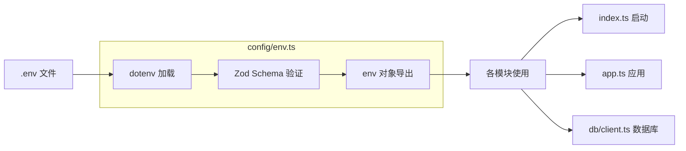

本文档详细介绍 admin-air 后端项目的环境变量配置体系，涵盖配置加载机制、各类环境参数说明以及配置文件组织结构。

## 配置架构概述

admin-air 后端采用**集中式环境配置**模式，通过单一配置文件 `env.ts` 统一管理所有环境变量。该文件负责从 `.env` 文件加载环境变量、使用 Zod 进行类型安全验证，并导出标准化的配置对象供其他模块使用。



Sources: [server/src/config/env.ts](server/src/config/env.ts#L1-L40)

## 环境变量详解

### 数据库配置

| 变量名 | 说明 | 默认值 |
|--------|------|--------|
| `POSTGRES_HOST` | PostgreSQL 服务器地址 | 127.0.0.1 |
| `POSTGRES_PORT` | PostgreSQL 端口号 | 5432 |
| `POSTGRES_DB` | 数据库名称 | admin_air |
| `POSTGRES_USER` | 数据库用户名 | postgres |
| `POSTGRES_PASSWORD` | 数据库密码 | postgres |
| `DATABASE_URL` | 完整连接字符串（可选） | 自动拼接 |

当未设置 `DATABASE_URL` 时，系统会自动拼接构建完整的连接字符串，格式为：
```
postgresql://${POSTGRES_USER}:${POSTGRES_PASSWORD}@${POSTGRES_HOST}:${POSTGRES_PORT}/${POSTGRES_DB}
```

Sources: [server/.env.example](server/.env.example#L1-L5)

### 服务器配置

| 变量名 | 说明 | 默认值 |
|--------|------|--------|
| `PORT` | 服务器监听端口 | 8787 |
| `APP_BASE_URL` | 应用基础 URL | http://127.0.0.1:8787 |

Sources: [server/.env.example](server/.env.example#L6-L7)

### JWT 安全配置

| 变量名 | 说明 | 最小长度要求 |
|--------|------|--------------|
| `JWT_SECRET` | 访问令牌签名密钥 | 16 字符 |
| `JWT_REFRESH_SECRET` | 刷新令牌签名密钥 | 16 字符 |

这两个密钥用于 JWT 令牌的签发与验证，生产环境建议使用加密强度高的随机字符串。

Sources: [server/.env.example](server/.env.example#L8-L9)

## 配置加载机制

配置模块使用 `dotenv` 库加载环境变量，通过 `Zod` 进行运行时验证。这种设计确保了：

1. **类型安全**：所有环境变量在启动时经过类型验证，避免运行时错误
2. **默认值支持**：Zod schema 为每个字段提供默认值，增强鲁棒性
3. **错误即停**：配置错误会导致应用启动失败，便于快速发现问题

```typescript
// server/src/config/env.ts 核心逻辑
import { config as loadEnv } from 'dotenv'
import { z } from 'zod'

loadEnv()  // 加载 .env 文件

const schema = z.object({
    // 定义所有环境变量及其验证规则
    POSTGRES_HOST: z.string().default('127.0.0.1'),
    JWT_SECRET: z.string().min(16).default('...'),
    // ...
})

const parsed = schema.parse(process.env)  // 验证并解析
export const env = { /* 导出标准化配置 */ }
```

Sources: [server/src/config/env.ts](server/src/config/env.ts#L1-L40)

## 派生配置

除直接读取的环境变量外，`env.ts` 还导出了多个派生配置项：

| 派生配置 | 来源 | 说明 |
|----------|------|------|
| `databaseUrl` | 拼接或 DATABASE_URL | 完整数据库连接字符串 |
| `uploadsDir` | `resolve(process.cwd(), 'uploads')` | 文件上传存储目录 |
| `accessTokenTtlSeconds` | 固定值 `60 * 60 * 2` | 访问令牌有效期 2 小时 |
| `refreshTokenTtlSeconds` | 固定值 `60 * 60 * 24 * 7` | 刷新令牌有效期 7 天 |

Sources: [server/src/config/env.ts](server/src/config/env.ts#L35-L40)

## 配置文件结构

项目包含两个关键的配置文件：

```
server/
├── .env              # 本地开发环境配置（已包含真实值）
├── .env.example      # 环境变量模板（供团队成员参考）
├── src/
│   └── config/
│       └── env.ts    # 配置加载与验证逻辑
```

### .env 与 .env.example 的区别

- **`.env.example`**：列出所有可配置项及示例值，供新成员快速了解配置结构
- **`.env`**：本地实际使用的配置文件，包含当前开发环境的真实值（已加入版本控制）

Sources: [server/.env.example](server/.env.example#L1-L11), [server/.env](server/.env#L1-L11)

## 配置使用示例

后端各模块通过导入 `env` 对象使用配置：

```typescript
// 数据库连接
import { env } from './config/env'
// env.databaseUrl 用于 postgres 连接

// 服务启动
import { env } from './config/env'
// env.port 指定服务器监听端口

// 静态文件服务
import { env } from './config/env'
// env.uploadsDir 指定上传文件存放目录
```

Sources: [server/src/db/client.ts](server/src/db/client.ts#L1-L11), [server/src/index.ts](server/src/index.ts#L1-L25), [server/src/app.ts](server/src/app.ts#L1-L56)

## 环境配置检查清单

在本地启动后端服务前，请确认以下配置项：

1. **数据库连接**：确保 PostgreSQL 服务运行中，`DATABASE_URL` 可正常连接
2. **端口占用**：确认 `PORT` 指定的端口（默认 8787）未被占用
3. **JWT 密钥**：生产环境需更换为强随机值，开发环境可使用默认值
4. **上传目录**：确保 `uploadsDir` 目录存在，或由应用自动创建

如需修改环境变量，直接编辑 `server/.env` 文件后重启服务即可生效。

---

**相关文档：**
- [数据库与Schema](9-shu-ju-ku-yu-schema) - 了解数据模型定义
- [数据初始化与Seed](10-shu-ju-chu-shi-hua-yu-seed) - 了解数据初始化流程
- [后端开发命令](17-hou-duan-kai-fa-ming-ling) - 后端常用开发命令参考