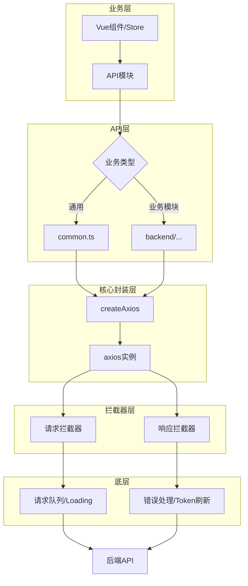

本页面详细介绍前端项目的 HTTP 请求封装机制，涵盖核心请求工厂函数、通用 API 工具、类型定义以及最佳使用模式。该封装层在 axios 基础上构建了企业级应用所需的重试机制、错误处理、请求取消和统一响应格式等功能。

## 1. 架构概述

前端请求封装采用分层架构设计，核心层基于 axios 扩展，上层提供面向业务的 API 模块和通用工具函数。



**核心职责划分**：业务层通过 API 模块发起请求，核心封装层通过 `createAxios` 工厂函数创建配置化的 axios 实例，请求拦截器负责 Token 注入和重复请求取消，响应拦截器处理业务错误码和 HTTP 状态错误。

Sources: [axios.ts](web/src/utils/axios.ts#L1-L50), [global.d.ts](web/types/global.d.ts#L15-L25)

## 2. 核心请求工厂函数

`createAxios` 是整个封装层的核心函数，它接收 axios 配置和选项参数，返回经过拦截器处理的 Promise 对象。

### 2.1 函数签名与基础用法

```typescript
function createAxios<Data = any, T = ApiPromise<Data>>(
    axiosConfig: AxiosRequestConfig, 
    options: Options = {}, 
    loading: LoadingOptions = {}
): T
```

基础调用示例展示了最常见的 GET 请求场景，通过 `params` 参数传递查询字符串：

```typescript
import createAxios from '/@/utils/axios'

// GET 请求
const response = createAxios({
    url: '/api/admin/init',
    method: 'get',
})

// POST 请求
const response = createAxios({
    url: '/api/auth/login',
    data: params,
    method: 'post',
})
```

Sources: [axios.ts](web/src/utils/axios.ts#L52-L65)

### 2.2 配置选项详解

`Options` 接口提供了丰富的请求行为控制能力，开发者可通过配置选项灵活控制请求的各个维度。

| 选项 | 类型 | 默认值 | 说明 |
|------|------|--------|------|
| `cancelDuplicateRequest` | `boolean` | `true` | 是否取消重复请求，相同 URL、Method、参数的请求会被自动忽略 |
| `loading` | `boolean` | `false` | 是否显示全局 Loading 动画 |
| `reductDataFormat` | `boolean` | `true` | 是否简化返回数据，直接返回 `response.data` 而非完整 response 对象 |
| `showErrorMessage` | `boolean` | `true` | 是否在请求失败时显示错误通知 |
| `showCodeMessage` | `boolean` | `true` | 是否显示业务错误码对应的消息 |
| `showSuccessMessage` | `boolean` | `false` | 是否在请求成功时显示成功通知 |
| `anotherToken` | `string` | `''` | 显式指定使用的 Token，优先级高于 store 中存储的 Token |

```typescript
// 带完整选项的请求示例
createAxios(
    {
        url: '/admin/routine.Config/del',
        method: 'DELETE',
        params: { ids },
    },
    {
        loading: true,
        showSuccessMessage: true,
        cancelDuplicateRequest: true,
    }
)
```

Sources: [axios.ts](web/src/utils/axios.ts#L34-L48)

### 2.3 请求取消机制

封装层内置了重复请求自动取消功能，通过 `pendingMap` 记录当前进行中的请求，相同键值的请求会自动取消先前的请求。

```typescript
function getPendingKey(config: AxiosRequestConfig) {
    let { data } = config
    const { url, method, params, headers } = config
    if (typeof data === 'string') data = JSON.parse(data)
    return [
        url,
        method,
        headers && (headers as anyObj).batoken ? (headers as anyObj).batoken : '',
        JSON.stringify(params),
        JSON.stringify(data),
    ].join('&')
}
```

**请求键的构成因素**：URL + 请求方法 + Token + 请求参数 + 请求体数据，这确保了真正相同的请求才会被去重。

Sources: [axios.ts](web/src/utils/axios.ts#L196-L210)

## 3. 响应拦截器与错误处理

响应拦截器承担着业务状态码解析、错误通知展示和 Token 失效处理等核心职责。

### 3.1 业务错误码处理

项目约定后端返回的 `code` 字段：`1` 表示成功，其他值表示失败。拦截器会自动根据 code 值决定是否抛出错误。

```typescript
if (response.data.code !== 1) {
    // Token 失效处理 (303/401)
    if (response.data.code === 303 || response.data.code === 401) {
        adminInfo.removeToken()
        if (router.currentRoute.value.name !== 'adminLogin') {
            router.push({ name: 'adminLogin' })
        }
    }
    // 显示业务错误消息
    if (options.showCodeMessage) {
        ElNotification({
            type: 'error',
            message: response.data.msg || translate('axios.Abnormal problem...'),
            zIndex: SYSTEM_ZINDEX,
        })
    }
    return Promise.reject(response.data)
}
```

**自动跳转逻辑**：当后端返回 303（Token 过期）或 401（未授权）时，系统自动清除本地 Token 并重定向到登录页。

Sources: [axios.ts](web/src/utils/axios.ts#L82-L98)

### 3.2 HTTP 状态错误处理

封装层提供了完整的 HTTP 状态码到用户友好消息的映射：

| 状态码 | 错误消息 |
|--------|----------|
| 400 | 请求参数错误 |
| 401 / 403 | 无操作权限 |
| 404 | 请求地址错误 |
| 408 | 请求超时 |
| 500 | 服务器内部错误 |
| 网络错误 | 网络断开或服务器异常 |

```typescript
function httpErrorStatusHandle(error: any) {
    if (axios.isCancel(error)) return
    
    let message = ''
    if (error && error.response) {
        switch (error.response.status) {
            case 400:
                message = translate('axios.Incorrect parameter!')
                break
            case 401:
            case 403:
                message = translate('axios.You do not have permission to operate!')
                break
            // ... 其他状态码
        }
    }
    // 网络错误处理
    if (error.message?.includes('timeout')) message = translate('axios.Network request timeout!')
    if (error.message?.includes('Network')) {
        message = window.navigator.onLine 
            ? translate('axios.Server exception!') 
            : translate('axios.You are disconnected!')
    }
}
```

Sources: [axios.ts](web/src/utils/axios.ts#L121-L156)

## 4. 通用 API 模块

`web/src/api/common.ts` 提供了面向业务场景的通用 API 工具函数，包括文件上传、地区数据获取和表格 CRUD 操作封装。

### 4.1 文件上传封装

文件上传函数内置了 MIME 类型校验和文件大小限制，校验失败时会直接 reject 并弹出错误提示，而非发送无效请求。

```typescript
export function fileUpload(fd: FormData, params: anyObj = {}, _forceLocal = false, config: AxiosRequestConfig = {}): ApiPromise {
    let errorMsg = ''
    const file = fd.get('file') as UploadRawFile
    const siteConfig = useSiteConfig()

    // 三重校验：文件名、文件类型、文件大小
    if (!file.name || typeof file.size == 'undefined') {
        errorMsg = translate('utils.The data of the uploaded file is incomplete!')
    } else if (!checkFileMimetype(file.name, file.type)) {
        errorMsg = translate('utils.The type of uploaded file is not allowed!')
    } else if (file.size > siteConfig.upload.maxSize) {
        errorMsg = translate('utils.The size of uploaded file exceeds the allowed range!')
    }

    if (errorMsg) {
        return new Promise((resolve, reject) => {
            ElNotification({ type: 'error', message: errorMsg, zIndex: SYSTEM_ZINDEX })
            reject(errorMsg)
        })
    }

    return createAxios({
        url: adminUploadUrl,
        method: 'POST',
        data: fd,
        params,
        timeout: 0,  // 上传文件不设置超时
        ...config,
    })
}
```

Sources: [common.ts](web/src/api/common.ts#L10-L47)

### 4.2 表格 CRUD 封装

`baTableApi` 类为管理后台常见的表格操作提供了标准化的请求封装，封装了列表查询、编辑、删除和排序等常用方法。

```typescript
export class baTableApi {
    private controllerUrl
    public actionUrl

    constructor(controllerUrl: string) {
        this.controllerUrl = controllerUrl
        this.actionUrl = new Map([
            ['index', controllerUrl + 'index'],
            ['add', controllerUrl + 'add'],
            ['edit', controllerUrl + 'edit'],
            ['del', controllerUrl + 'del'],
            ['sortable', controllerUrl + 'sortable'],
        ])
    }

    index(filter: BaTable['filter'] = {}) {
        return createAxios<TableDefaultData>({
            url: this.actionUrl.get('index'),
            method: 'get',
            params: filter,
        })
    }

    del(ids: string[]) {
        return createAxios(
            {
                url: this.actionUrl.get('del'),
                method: 'DELETE',
                params: { ids },
            },
            { showSuccessMessage: true }
        )
    }

    postData(action: string, data: anyObj) {
        return createAxios(
            {
                url: actionUrl.has(action) ? actionUrl.get(action) : controllerUrl + action,
                method: 'post',
                data,
            },
            { showSuccessMessage: true }
        )
    }
}
```

**使用示例**：

```typescript
// 在业务模块中继承 baTableApi
import { baTableApi } from '/@/api/common'

const configApi = new baTableApi('/admin/routine.Config/')

// 列表查询
configApi.index({ page: 1, limit: 10 })

// 删除操作
configApi.del(['1', '2'])

// 自定义操作
configApi.postData('sendTestMail', { /* data */ })
```

Sources: [common.ts](web/src/api/common.ts#L94-L151)

## 5. 类型定义

项目在 `web/types/global.d.ts` 中定义了完整的请求响应类型体系，确保 TypeScript 类型安全。

```typescript
interface ApiResponse<T = any> {
    code: number      // 业务状态码，1 表示成功
    data: T          // 业务数据
    msg: string      // 消息文本
    time: number     // 时间戳
}

type ApiPromise<T = any> = Promise<ApiResponse<T>>

interface TableDefaultData<T = any> {
    list: T          // 数据列表
    remark: string  // 备注信息
    total: number    // 总记录数
}
```

开发者可利用这些类型在业务代码中获得完整的类型提示：

```typescript
// 返回类型自动推断为 ApiPromise<UserInfo>
const userInfo = createAxios<UserInfo>({
    url: '/api/user/info',
    method: 'get',
})
```

Sources: [global.d.ts](web/types/global.d.ts#L15-L28)

## 6. 最佳实践与使用模式

### 6.1 业务 API 模块组织

建议按业务模块组织 API 接口，创建对应的模块文件：

```typescript
// web/src/api/backend/routine/config.ts
import createAxios from '/@/utils/axios'

export const url = '/admin/routine.Config/'
export const actionUrl = new Map([
    ['index', url + 'index'],
    ['add', url + 'add'],
    ['edit', url + 'edit'],
    ['del', url + 'del'],
    ['sendTestMail', url + 'sendTestMail'],
])

export function index() {
    return createAxios({ url: actionUrl.get('index'), method: 'get' })
}

export function postData(action: string, data: anyObj) {
    return createAxios(
        { url: actionUrl.get(action), method: 'post', data },
        { showSuccessMessage: true }
    )
}
```

Sources: [config.ts](web/src/api/backend/routine/config.ts#L1-L30)

### 6.2 请求与响应数据格式化

封装层提供了 `requestPayload` 工具函数，可根据请求方法自动返回正确的数据结构：

```typescript
import { requestPayload } from '/@/utils/axios'

// 根据 method 自动选择 params 或 data
const payload = requestPayload('POST', { name: 'test' })
// -> { data: { name: 'test' } }

const payload2 = requestPayload('GET', { id: 1 })
// -> { params: { id: 1 } }
```

Sources: [axios.ts](web/src/utils/axios.ts#L200-L211)

## 7. 相关文档导航

本页面描述的请求封装层是前后端通信的核心基础设施，掌握后将继续以下主题：

- **[前后端API契约](15-qian-hou-duan-apiqi-yue)** - 了解 API 响应格式约定的详细规范
- **[前端开发命令](16-qian-duan-kai-fa-ming-ling)** - 掌握开发环境的启动与调试命令
- **[前端状态管理](5-qian-duan-zhuang-tai-guan-li)** - 学习如何使用 store 管理 Token 和用户状态

如需深入了解请求封装的底层实现，建议直接查看 [axios.ts](web/src/utils/axios.ts) 源文件。