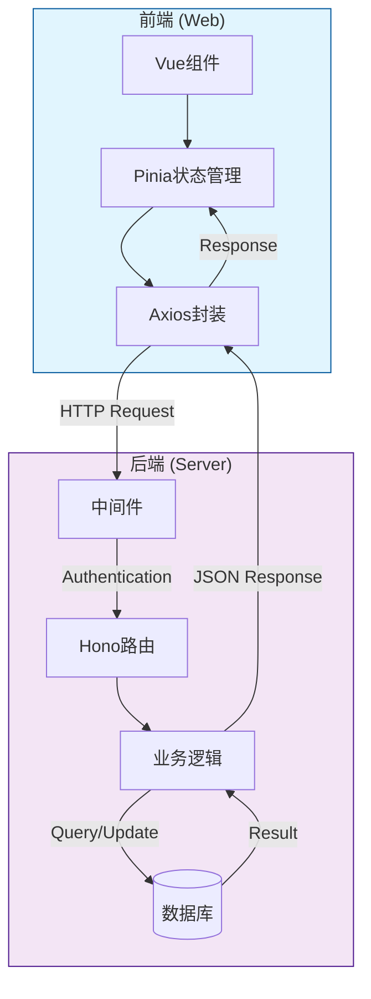

本页面详细阐述本项目中前后端之间的API通信规范、请求/响应格式、认证机制以及前后端交互的约定。这些契约是前后端协作开发的基础，确保数据交互的一致性和可靠性。

## 整体架构概览

本项目采用典型的前后端分离架构，后端使用Hono框架构建RESTful API，前端使用Axios封装HTTP请求库进行通信。整体API交互流程涉及认证、请求拦截、响应处理和错误管理四个核心环节。



## 响应数据格式

项目采用统一的JSON响应格式，无论请求成功或失败，后端均返回结构一致的数据结构。前端通过响应拦截器自动解析该格式。

### 成功响应

```typescript
{
    "code": 1,
    "msg": "操作成功",
    "data": { ... }
}
```

成功响应的特征是`code`字段值为`1`，`msg`为操作描述信息，`data`包含实际业务数据。

Sources: [response.ts](server/src/shared/http/response.ts#L1-L16)

### 失败响应

```typescript
{
    "code": 0,
    "msg": "操作失败",
    "data": null
}
```

失败响应的特征是`code`字段值为`0`（或其他非1的错误码），`msg`为错误描述信息，`data`为`null`。

Sources: [response.ts](server/src/shared/http/response.ts#L1-L16)

### 响应码含义表

| code值 | 含义 | 典型场景 |
|--------|------|----------|
| 1 | 成功 | 正常业务处理完成 |
| 0 | 通用失败 | 参数错误、业务逻辑错误 |
| 303 | 会话失效 | token无效或已过期 |
| 401 | 未授权 | 未登录或登录已失效 |

Sources: [axios.ts](web/src/utils/axios.ts#L58-L62)

## 认证与鉴权机制

项目采用双Token认证方案，结合会话状态管理，确保用户身份的安全性和会话的有效性。

### Token传递规范

认证信息通过HTTP请求头传递，使用`batoken`字段名称：

```typescript
// 前端请求头设置
if (token) {
    (requestConfig.headers as anyObj).batoken = token
}
```

Token支持三种传递方式，优先级依次为：请求头 > Authorization Bearer > URL查询参数。

Sources: [service.ts](server/src/modules/auth/service.ts#L16-L22)

### 双Token机制

系统使用两种类型的Token实现安全的会话管理：

| Token类型 | 用途 | 有效期 | 刷新机制 |
|-----------|------|--------|----------|
| accessToken | 访问令牌 | 较短（默认2小时） | 需通过refreshToken刷新 |
| refreshToken | 刷新令牌 | 较长（默认7天） | 可换取新的accessToken |

登录成功后，后端返回包含两种Token的响应对象：

```typescript
return {
    userInfo: await getCurrentAdminPayload(admin.id, { token: accessToken, refresh_token: refreshToken }),
    token: accessToken,
    refresh_token: refreshToken,
}
```

Sources: [service.ts](server/src/modules/auth/service.ts#L32-L64)

### Token刷新流程

当accessToken过期时，前端使用refreshToken调用刷新接口获取新的令牌对：

```typescript
// 后端刷新接口
app.post('/api/common/refreshToken', async (c) => {
    const body: { refreshToken?: string } = await c.req.json()
    const data = await refreshSession(String(body.refreshToken ?? ''), c.req.raw)
    return success(c, data, '刷新成功')
})
```

前端通过响应拦截器自动处理Token刷新和会话失效场景。

Sources: [routes.ts](server/src/modules/auth/routes.ts#L18-L28)

### 认证中间件

项目通过`requireAuth`中间件实现接口级别的访问控制，需要认证的路由通过Hono的`use`方法挂载中间件：

```typescript
app.use('/admin/auth.Admin/*', requireAuth)
app.use('/admin/routine.AdminInfo/*', requireAuth)
```

中间件验证Token有效性并注入管理员信息到请求上下文：

```typescript
c.set('admin', {
    id: admin.id,
    username: admin.username,
    nickname: admin.nickname,
    // ...
})
```

Sources: [service.ts](server/src/modules/auth/service.ts#L88-L123)

## API路由规范

项目采用模块化的路由组织方式，不同功能模块拥有独立的前缀和命名空间。

### 路由模块划分

| 模块 | 路由前缀 | 功能描述 |
|------|----------|----------|
| auth | `/api/auth/*` | 认证相关：登录、登出、Token刷新 |
| admin | `/admin/auth.*` | 管理员、角色组、规则、日志管理 |
| routine | `/admin/routine.*` | 常规功能：个人信息、附件管理 |
| common | `/admin/ajax/*` | 通用功能：文件上传、地区选择 |

Sources: [app.ts](server/src/app.ts#L44-L46)

### RESTful风格约定

项目遵循RESTful API设计原则，使用HTTP方法语义区分操作类型：

| HTTP方法 | 用途 | 示例 |
|----------|------|------|
| GET | 获取数据 | `/admin/auth.Admin/index` 获取管理员列表 |
| POST | 创建/更新 | `/admin/auth.Admin/add` 添加管理员 |
| PUT | 更新 | `/admin/auth.Admin/edit` 编辑管理员 |
| DELETE | 删除 | `/admin/auth.Admin/del` 删除管理员 |

Sources: [routes.ts](server/src/modules/admin/routes.ts#L1-L152)

### 命名空间规范

项目采用`模块.实体`格式的命名空间，例如`auth.Admin`表示管理员管理模块，`routine.Attachment`表示附件管理模块。这种命名方式既保持了路由的可读性，也便于权限系统的精细化控制。

## 前端API封装

前端通过统一的Axios封装实现API调用的标准化处理，包含请求配置、拦截器逻辑和响应处理。

### createAxios封装

```typescript
function createAxios<Data = any, T = ApiPromise<Data>>(axiosConfig: AxiosRequestConfig, options: Options = {}, loading: LoadingOptions = {}): T {
    const Axios = axios.create({
        baseURL: getUrl(),
        timeout: 1000 * 10,
        headers: {
            server: true,
        },
        responseType: 'json',
    })
    // ...拦截器配置
}
```

Sources: [axios.ts](web/src/utils/axios.ts#L24-L78)

### 拦截器处理逻辑

前端拦截器承担四项核心职责：

1. **请求拦截**：Token注入、重复请求取消、 loading状态管理
2. **响应成功拦截**：数据解包、错误码判断、成功提示
3. **响应失败拦截**：HTTP状态处理、错误提示展示、401自动跳转登录
4. **请求队列管理**：防止相同请求重复发送

Sources: [axios.ts](web/src/utils/axios.ts#L80-L150)

### baTableApi基类

针对管理后台常见的表格场景，项目定义了`baTableApi`基类，提供标准化的增删改查接口封装：

```typescript
export class baTableApi {
    private controllerUrl
    public actionUrl

    constructor(controllerUrl: string) {
        this.controllerUrl = controllerUrl
        this.actionUrl = new Map([
            ['index', controllerUrl + 'index'],
            ['add', controllerUrl + 'add'],
            ['edit', controllerUrl + 'edit'],
            ['del', controllerUrl + 'del'],
            ['sortable', controllerUrl + 'sortable'],
        ])
    }
}
```

开发者只需继承该类并传入控制器的URL前缀，即可获得完整的表格操作能力。

Sources: [common.ts](web/src/api/common.ts#L109-L166)

### API模块组织

前端API按业务模块划分目录，典型结构如下：

```
web/src/api/
├── backend/
│   ├── auth/
│   │   └── group.ts      # 角色组API
│   ├── routine/
│   │   ├── AdminInfo.ts  # 管理员信息API
│   │   └── config.ts     # 配置相关API
│   └── index.ts
└── common.ts             # 公共API工具
```

每个API模块遵循统一的导出模式：定义URL常量、构建actionUrl映射、封装具体请求函数。

Sources: [AdminInfo.ts](web/src/api/backend/routine/AdminInfo.ts#L1-L38)

## 核心业务API示例

以下是项目中几个核心业务场景的API调用示例，展示了前后端交互的具体实现方式。

### 登录接口

```typescript
// 前端调用
export function login(data: { username: string; password: string }) {
    return createAxios({
        url: '/api/auth/login',
        method: 'post',
        data,
    })
}

// 后端响应
{
    "code": 1,
    "msg": "登录成功",
    "data": {
        "userInfo": { ... },
        "token": "eyJ...",
        "refresh_token": "eyJ..."
    }
}
```

Sources: [routes.ts](server/src/modules/auth/routes.ts#L7-L16)

### 管理员列表查询

```typescript
// 前端调用
export function index() {
    return createAxios({
        url: '/admin/auth.Admin/index',
        method: 'get',
    })
}

// 后端响应
{
    "code": 1,
    "msg": "ok",
    "data": {
        "list": [...],
        "total": 100,
        "remark": "..."
    }
}
```

Sources: [routes.ts](server/src/modules/admin/routes.ts#L31-L33)

### 文件上传

```typescript
// 前端调用 - 使用FormData
export function fileUpload(fd: FormData, params: anyObj = {}) {
    return createAxios({
        url: '/admin/ajax/upload',
        method: 'POST',
        data: fd,
        params,
        timeout: 0,
    })
}

// 后端响应
{
    "code": 1,
    "msg": "上传成功",
    "data": {
        "file": {
            "url": "/uploads/123456.jpg",
            "full_url": "http://localhost:9000/uploads/123456.jpg",
            "name": "image.jpg"
        }
    }
}
```

Sources: [service.ts](server/src/modules/routine/service.ts#L25-L58)

## 错误处理约定

项目建立了完善的错误处理机制，涵盖HTTP错误、业务错误和网络异常三个层面。

### HTTP状态码处理

| 状态码 | 含义 | 前端处理 |
|--------|------|----------|
| 400 | 参数错误 | 提示"参数不正确" |
| 401/403 | 无权限 | 跳转登录页 |
| 404 | 请求地址错误 | 提示错误URL |
| 408 | 请求超时 | 提示"请求超时" |
| 500 | 服务器内部错误 | 提示"服务器内部错误" |

Sources: [axios.ts](web/src/utils/axios.ts#L135-L168)

### 业务错误码处理

当前端检测到响应数据中`code !== 1`时，会自动触发以下处理流程：

1. 判断是否为会话失效错误码（303/401）
2. 若是，则清除Token并重定向到登录页
3. 根据配置决定是否显示错误消息
4. 拒绝Promise链，将控制权交给调用方

Sources: [axios.ts](web/src/utils/axios.ts#L55-L75)

### 网络异常处理

针对网络层面的异常情况，系统进行了细粒度的区分处理：

```typescript
if (error.message?.includes('timeout')) 
    message = translate('axios.Network request timeout!')
if (error.message?.includes('Network')) {
    message = window.navigator.onLine 
        ? translate('axios.Server exception!') 
        : translate('axios.You are disconnected!')
}
```

这种处理方式能够准确区分服务器宕机和客户端断网两种情况。

Sources: [axios.ts](web/src/utils/axios.ts#L170-L175)

## 数据传输规范

### 请求体格式

项目使用JSON作为主要的请求体格式，对于文件上传等场景使用`multipart/form-data`格式。后端通过Hono的`parseBody`方法智能解析不同类型的请求体：

```typescript
// JSON请求解析
const data = await c.req.json<{ username?: string; password?: string }>()

// FormData解析（含文件上传）
const body = await c.req.parseBody()
const file = body.file  // File对象
```

Sources: [routes.ts](server/src/modules/auth/routes.ts#L8-L9)

### 分页参数约定

列表查询接口采用URL查询参数传递分页信息：

| 参数名 | 类型 | 说明 |
|--------|------|------|
| page | number | 当前页码（默认1） |
| limit | number | 每页条数（默认15） |
| quickSearch | string | 快速搜索关键词 |
| filter[字段名] | string | 字段过滤条件 |

响应数据中包含`list`数组和`total`总数，用于前端分页组件的渲染。

Sources: [baTable.ts](web/src/utils/baTable.ts#L69-L86)

## 后续学习建议

完成本页面学习后，建议按以下顺序继续深入：

- [前端请求封装](14-qian-duan-qing-qiu-feng-zhuang) — 深入了解前端Axios封装细节
- [后端路由与模块](8-hou-duan-lu-you-yu-mo-kuai) — 了解后端模块组织方式
- [前端状态管理](5-qian-duan-zhuang-tai-guan-li) — 了解Token的状态管理实现
- [数据库操作命令](18-shu-ju-ku-cao-zuo-ming-ling) — 了解数据层交互方式