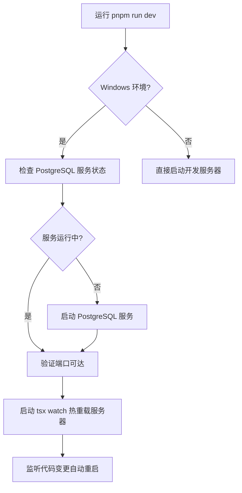
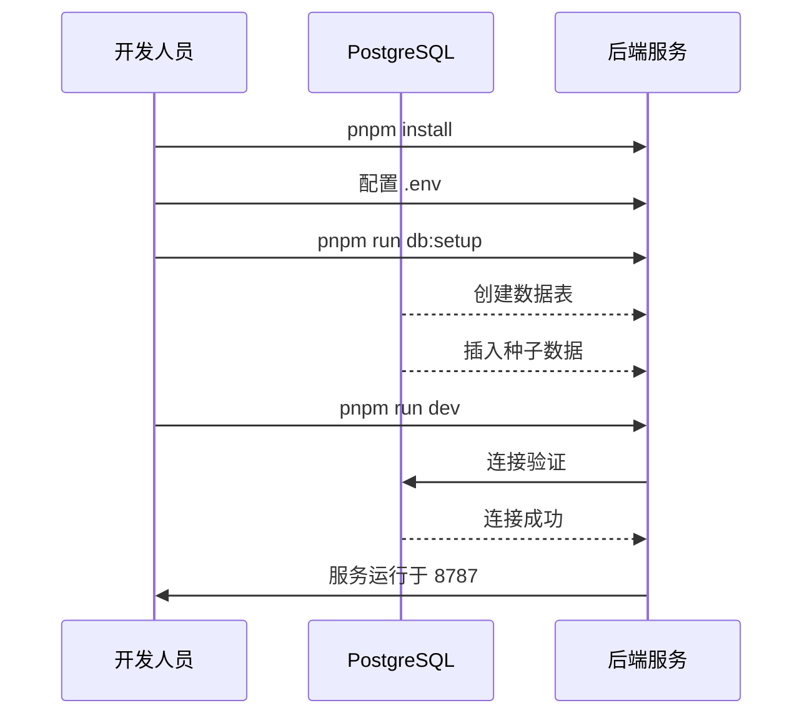

本文档详细介绍 admin-air 项目后端的全部开发命令，涵盖开发启动、数据库操作、代码检查等核心命令的使用方法。

## 命令概览

admin-air 后端基于 Node.js + Hono 框架构建，使用 pnpm 作为包管理工具。所有命令均在 `server` 目录下执行。 package.json 中定义了以下核心脚本命令：

| 命令 | 说明 | 使用场景 |
|------|------|----------|
| `pnpm run dev` | 完整开发启动（含 PostgreSQL 服务检查） | 首次启动/日常开发 |
| `pnpm run dev:raw` | 直接启动开发服务器 | 跳过数据库服务检查 |
| `pnpm run db:generate` | 生成 Drizzle 数据库迁移文件 | 定义数据模型变更后 |
| `pnpm run db:migrate` | 执行数据库迁移 | 应用数据表变更 |
| `pnpm run db:seed` | 初始化种子数据 | 首次部署/重置测试数据 |
| `pnpm run db:setup` | 执行迁移+种子数据初始化 | 完整数据库环境准备 |
| `pnpm run build` | TypeScript 类型检查 | 提交前验证 |
| `pnpm run start` | 生产环境启动 | 部署运行 |
| `pnpm run lint` | ESLint 代码检查 | 代码审查 |
| `pnpm run lint-fix` | ESLint 自动修复 | 快速修复 |
| `pnpm run format` | Prettier 代码格式化 | 统一代码风格 |

Sources: [package.json](server/package.json#L1-L41)

## 开发环境启动

### 标准启动命令

```bash
cd server
pnpm run dev
```

这是最常用的启动方式，执行流程如下：



该命令会自动完成以下步骤：

1. **检查 PostgreSQL 服务**：在 Windows 环境下检测 `postgresql-x64-18` 服务状态
2. **自动启动服务**：若服务未运行，自动尝试启动
3. **端口就绪检测**：验证数据库端口 `5432` 可连接
4. **启动开发服务器**：执行 `tsx watch` 监听文件变化热重载

Sources: [dev.ts](server/src/scripts/dev.ts#L1-L201)

### 快速启动命令

```bash
cd server
pnpm run dev:raw
```

跳过 PostgreSQL 服务检查，直接启动开发服务器。适用于：

- 已确认数据库正常运行
- 非 Windows 系统开发
- 调试服务启动逻辑

Sources: [package.json](server/package.json#L7)

## 数据库操作命令

### 生成迁移文件

```bash
pnpm run db:generate
```

根据 `src/db/schema/` 中的 TypeScript Schema 定义，自动生成 SQL 迁移文件到 `drizzle/` 目录。


生成的迁移文件命名格式：`0000_snapshot.sql`、`0001_xxx.sql`

Sources: [package.json](server/package.json#L8)
Sources: [drizzle.config.ts](server/drizzle.config.ts#L1-L16)

### 执行数据库迁移

```bash
pnpm run db:migrate
```

执行 `drizzle/` 目录下的所有待应用迁移文件，同时记录已执行迁移到 `_drizzle_migrations` 表。

Sources: [package.json](server/package.json#L9)
Sources: [migrate.ts](server/src/db/migrate.ts#L1-L40)

### 初始化种子数据

```bash
pnpm run db:seed
```

向数据库插入初始数据，包括：

- **管理员账户**：初始超级管理员账号
- **用户组**：权限分组
- **权限规则**：菜单、功能、接口权限
- **关联关系**：管理员-用户组、用户组-权限规则
- **日志数据**：初始化操作日志
- **附件数据**：示例附件记录

> **注意**：仅当 `admins` 表为空时才执行插入，避免重复初始化。

Sources: [package.json](server/package.json#L10)
Sources: [seed.ts](server/src/db/seed.ts#L1-L115)

### 完整数据库设置

```bash
pnpm run db:setup
```

依次执行 `db:migrate` + `db:seed`，一步完成数据库迁移和初始化。推荐首次启动时使用。

Sources: [package.json](server/package.json#L11)
Sources: [setup.ts](server/src/db/setup.ts#L1-L20)

## 构建与运行命令

### 类型检查

```bash
pnpm run build
```

执行 TypeScript 编译检查（`tsc --noEmit`），验证代码类型正确性，不生成输出文件。

Sources: [package.json](server/package.json#L12)

### 生产环境启动

```bash
pnpm run start
```

使用 `tsx` 直接运行生产入口文件 `./src/index.ts`。

Sources: [package.json](server/package.json#L13)

## 代码质量工具

### ESLint 代码检查

```bash
pnpm run lint
```

检查所有 TypeScript/JavaScript 文件，报告代码风格和潜在问题。

Sources: [package.json](server/package.json#L14)
Sources: [eslint.config.js](server/eslint.config.js#L1-L51)

### ESLint 自动修复

```bash
pnpm run lint-fix
```

自动修复 ESLint 可自动解决的问题（部分规则需手动处理）。

Sources: [package.json](server/package.json#L15)

### Prettier 代码格式化

```bash
pnpm run format
```

统一代码格式，包括缩进、引号、分号等风格配置。

Sources: [package.json](server/package.json#L16)

## 环境配置

后端运行依赖以下环境变量，需在 `server/.env` 文件中配置：

| 变量名 | 默认值 | 说明 |
|--------|--------|------|
| `POSTGRES_HOST` | 127.0.0.1 | 数据库地址 |
| `POSTGRES_PORT` | 5432 | 数据库端口 |
| `POSTGRES_DB` | admin_air | 数据库名称 |
| `POSTGRES_USER` | admin_air_dev | 数据库用户 |
| `POSTGRES_PASSWORD` | - | 数据库密码 |
| `DATABASE_URL` | postgresql://... | 完整连接字符串 |
| `PORT` | 8787 | 服务端口 |
| `APP_BASE_URL` | http://127.0.0.1:8787 | 应用基础 URL |
| `JWT_SECRET` | - | JWT 签名密钥 |
| `JWT_REFRESH_SECRET` | - | 刷新令牌密钥 |

> 生产环境请务必修改默认密钥，建议使用 64 位随机字符串。

Sources: [.env.example](server/.env.example#L1-L11)

## 典型工作流

### 首次启动完整流程



### 日常开发流程

```bash
# 1. 启动开发服务器（自动检查数据库）
cd server
pnpm run dev

# 2. 修改代码后自动热重载

# 3. 需要迁移时
pnpm run db:generate  # 生成迁移
pnpm run db:migrate   # 执行迁移

# 4. 提交前检查
pnpm run lint
pnpm run build
```

## 常见问题

### PostgreSQL 服务未启动

Windows 环境首次运行 `pnpm run dev` 时，若 PostgreSQL 服务未安装或未启动，命令会报错。请确认：

1. 已安装 PostgreSQL 18.x
2. 服务名称为 `postgresql-x64-18`
3. 使用管理员权限运行 PowerShell 启动：`Start-Service -Name 'postgresql-x64-18'`

### 端口占用

若 8787 端口被占用：

```bash
# 查看占用进程
netstat -ano | findstr :8787

# 结束进程
taskkill /PID <PID> /F
```

或修改 `.env` 中的 `PORT` 为其他端口。

### 数据库连接失败

检查 `.env` 配置：

- `DATABASE_URL` 格式是否正确
- 用户名密码是否匹配 PostgreSQL 用户
- 数据库是否已创建

## 下一步

完成后端命令学习后，建议继续：

- [数据库操作命令](18-shu-ju-ku-cao-zuo-ming-ling) - 深入学习数据库迁移和种子机制
- [代码质量检查](19-dai-ma-zhi-liang-jian-cha) - 了解 ESLint/Prettier 配置细节
- [首次启动流程](20-shou-ci-qi-dong-liu-cheng) - 完整的前后端启动指南