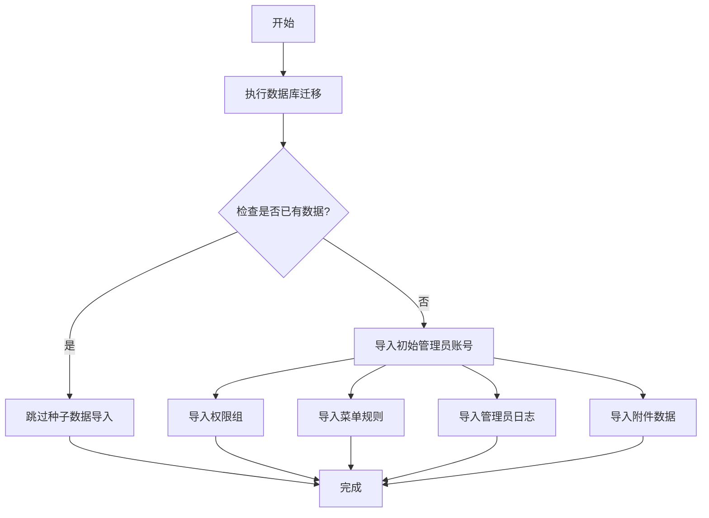

本页面详细介绍 Admin Air 项目从零开始的完整启动流程，帮助开发者完成环境准备、数据库初始化、前后端服务启动等关键步骤。这是初次运行项目的必读指南，建议按照以下顺序依次执行。

## 环境准备与依赖安装

### 1. 环境要求

在开始之前，请确保本地开发环境满足以下要求：

| 类别 | 要求 | 说明 |
|------|------|------|
| Node.js | >= 20.x | 推荐使用 nvm 管理 Node 版本 |
| pnpm | >= 8.x | 项目采用 pnpm 作为包管理器 |
| PostgreSQL | >= 14.x | 数据库服务 |

### 2. 安装项目依赖

项目采用前后端分离架构，需要分别在 `server` 和 `web` 目录下安装依赖。进入项目根目录后，执行以下命令：

```bash
# 安装后端依赖
cd server
pnpm install

# 安装前端依赖
cd ../web
pnpm install
```

依赖安装完成后，项目根目录下的 `pnpm-lock.yaml` 文件会记录所有依赖版本信息，确保团队成员使用一致的依赖环境。

Sources: [server/package.json](server/package.json#L1-L41), [web/package.json](web/package.json#L1-L59)

## 数据库配置与初始化

### 1. 配置环境变量

后端服务依赖数据库连接配置。复制环境变量模板文件并根据本地环境进行修改：

```bash
# 进入后端目录
cd server

# 复制环境变量模板
copy .env.example .env
```

编辑 `server/.env` 文件，配置以下关键参数：

| 变量名 | 说明 | 默认值 |
|--------|------|--------|
| POSTGRES_HOST | 数据库主机地址 | 127.0.0.1 |
| POSTGRES_PORT | 数据库端口 | 5432 |
| POSTGRES_DB | 数据库名称 | admin_air |
| POSTGRES_USER | 数据库用户名 | admin_air_dev |
| POSTGRES_PASSWORD | 数据库密码 | change-me |
| PORT | 后端服务端口 | 8787 |
| JWT_SECRET | JWT 签名密钥 | change-me-to-a-random-64-char-secret |

**重要提示**：请务必修改默认密码和 JWT 密钥，生产环境应使用强密码。

Sources: [server/.env.example](server/.env.example#L1-L11)

### 2. 创建数据库

确保 PostgreSQL 服务已启动，然后创建空数据库：

```bash
# 使用 psql 命令行工具
psql -U postgres -c "CREATE DATABASE admin_air;"

# 或者使用 pgAdmin 等图形化工具创建
```

### 3. 执行数据库迁移与种子数据

项目使用 Drizzle ORM 管理数据库 schema。首次启动需要执行迁移并导入初始数据。项目提供了便捷的 `db:setup` 命令一步完成所有数据库初始化工作：

```bash
cd server
pnpm run db:setup
```

该命令会自动执行以下操作：



Sources: [server/src/db/setup.ts](server/src/db/setup.ts#L1-L20), [server/src/db/seed.ts](server/src/db/seed.ts#L1-L115)

### 4. 种子数据说明

初始化完成后，系统会自动创建以下默认数据：

| 数据类型 | 说明 | 备注 |
|----------|------|------|
| 管理员 | 2 个初始管理员账号 | 详见下方表格 |
| 权限组 | 2 个默认用户组 | 超级管理员组、内容管理员组 |
| 菜单规则 | 系统完整菜单结构 | 包含控制台、权限管理等模块 |
| 管理员日志 | 初始登录记录 | 用于演示日志功能 |

默认管理员账号：

| 用户名 | 密码 | 角色 |
|--------|------|------|
| admin | AdminAir_2026 | 超级管理员 |
| editor | EditorAir_2026 | 内容管理员 |

Sources: [server/src/bootstrap/bootstrap-data.ts](server/src/bootstrap/bootstrap-data.ts#L75-L102)

## 后端服务启动

完成数据库配置后，启动后端开发服务：

```bash
cd server
pnpm run dev
```

后端服务启动后，会监听 `http://127.0.0.1:8787`。开发模式下，服务支持热重载，修改代码后会自动重启。

Sources: [server/package.json](server/package.json#L5)

## 前端服务启动

前端采用 Vite 作为构建工具。进入前端目录并启动开发服务器：

```bash
cd web
pnpm run dev
```

前端默认监听 `http://localhost:5173`，开发服务器启动后会自动打开浏览器窗口（可配置）。

Vite 配置了代理来解决跨域问题：

| 代理路径 | 目标地址 | 用途 |
|----------|----------|------|
| /api | http://127.0.0.1:8787 | REST API 请求 |
| /admin | http://127.0.0.1:8787 | 后端静态资源 |

Sources: [web/vite.config.ts](web/vite.config.ts#L37-L44), [web/.env](web/.env#L1-L6)

## 验证启动结果

### 1. 访问前端页面

打开浏览器访问 `http://localhost:5173`，应该能看到登录页面。

### 2. 使用初始账号登录

使用默认管理员账号登录：

- **用户名**：admin
- **密码**：AdminAir_2026

登录成功后即可进入后台管理系统。

### 3. 常见启动问题排查

| 问题现象 | 可能原因 | 解决方案 |
|----------|----------|----------|
| 前端页面无法打开 | 前端服务未启动 | 检查 `pnpm run dev` 是否正常运行 |
| 登录请求失败 | 后端服务未启动 | 检查后端是否监听 8787 端口 |
| 数据库连接失败 | 环境变量配置错误 | 检查 .env 中的数据库连接参数 |
| 登录后无权限 | 种子数据未导入 | 执行 `pnpm run db:setup` |

## 后续步骤

完成首次启动流程后，建议继续阅读以下页面了解项目更多细节：

- [快速启动](2-kuai-su-qi-dong) — 了解项目整体架构
- [后端环境配置](13-hou-duan-huan-jing-pei-zhi) — 深入了解后端配置
- [前端构建配置](11-qian-duan-gou-jian-pei-zhi) — 了解前端构建细节
- [数据库操作命令](18-shu-ju-ku-cao-zuo-ming-ling) — 掌握数据库管理命令