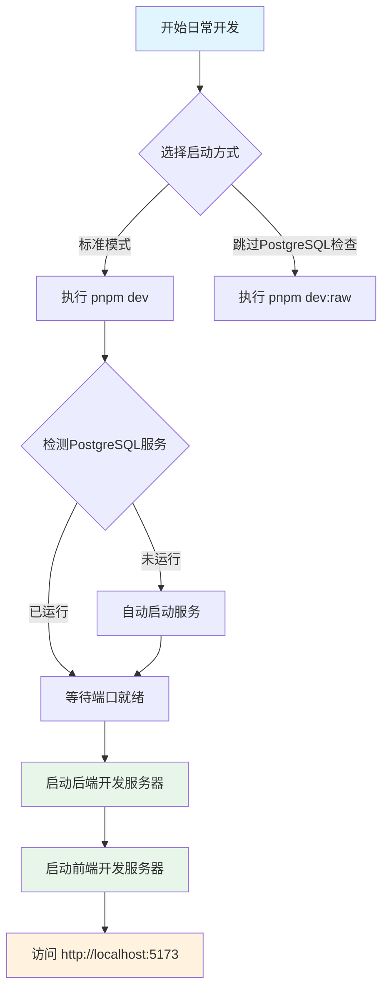

本文档介绍日常开发中如何启动前后端开发服务器。在首次启动或数据库重置后，请先阅读 [首次启动流程](20-shou-ci-qi-dong-liu-cheng) 了解完整的初始化步骤。日常开发启动假设数据库已经完成初始化，无需重复执行数据迁移和种子数据导入。

## 启动流程概览

日常开发启动分为两个步骤：启动后端服务、启动前端服务。后端启动脚本会自动检测 PostgreSQL 服务状态，未启动时自动启动。



## 后端服务启动

### 标准启动命令

在 `server/` 目录下执行：

```powershell
cd server
pnpm dev
```

此命令会依次执行以下操作：

1. **检测 PostgreSQL 服务状态** — 检查 Windows 服务 `postgresql-x64-18` 是否运行
2. **自动启动服务** — 如未运行，自动启动 PostgreSQL 服务
3. **等待数据库就绪** — 监听 `127.0.0.1:5432` 端口，确认数据库可接受连接
4. **启动后端开发服务器** — 执行 `tsx watch ./src/index.ts`

启动成功后，终端显示以下信息：

```
[数据库预检] PostgreSQL 服务 postgresql-x64-18 已启动。
[数据库预检] PostgreSQL 已监听 127.0.0.1:5432。
[数据库预检] 数据库预检通过，正在启动后端开发服务...
```

后端服务默认监听 `http://127.0.0.1:8787`，所有 API 以 `/api` 或 `/admin` 为前缀。

### 跳过 PostgreSQL 检查

如果已确认 PostgreSQL 正常运行，希望跳过预检步骤，可使用原始启动命令：

```powershell
cd server
pnpm dev:raw
```

Sources: [server/src/scripts/dev.ts](server/src/scripts/dev.ts#L113-L166), [server/package.json](server/package.json#L6)

## 前端服务启动

### 启动命令

在 `web/` 目录下执行：

```powershell
cd web
pnpm dev
```

前端开发服务器启动时，会先执行构建脚本，再启动 Vite 开发服务器。启动完成后，浏览器自动打开 `http://localhost:5173`。

### 服务配置说明

前端开发服务器的关键配置如下：

| 配置项 | 值 | 来源 |
|--------|-----|------|
| 开发端口 | `5173` | 环境变量 `VITE_PORT` |
| API 代理目标 | `http://127.0.0.1:8787` | vite.config.ts |
| 代理路径 | `/api`, `/admin` | vite.config.ts |

Sources: [web/vite.config.ts](web/vite.config.ts#L31-L39), [web/package.json](web/package.json#L5)

### 前端环境变量

开发环境默认使用以下配置（位于 `web/.env.development`）：

```env
ENV = 'development'
VITE_BASE_PATH = './'
VITE_AXIOS_BASE_URL = 'getCurrentDomain'
```

`VITE_AXIOS_BASE_URL = 'getCurrentDomain'` 表示 axios 会自动使用浏览器当前域名作为基础 URL，便于本地开发时通过代理访问后端 API。

## 验证服务运行状态

### 检查端口占用

开发服务器启动后，可通过以下命令验证服务是否正常监听：

```powershell
# 检查后端服务
netstat -an | findstr "8787"

# 检查前端服务
netstat -an | findstr "5173"
```

### 访问应用

服务正常启动后，访问以下地址：

- **前端地址**：`http://localhost:5173`
- **后端健康检查**：`http://127.0.0.1:8787/api/health`（如已实现）

### 登录验证

使用默认管理员账户登录系统：

| 字段 | 值 |
|------|-----|
| 用户名 | `admin` |
| 密码 | `AdminAir_2026` |

Sources: [docs/development-workflow.md](docs/development-workflow.md#L62-L68)

## 常见启动问题

### PostgreSQL 服务启动失败

**症状**：执行 `pnpm dev` 后报错 "无法获取 PostgreSQL 服务状态"

**排查步骤**：

1. 确认 PostgreSQL 已正确安装在 Windows 服务中
2. 检查服务名称是否为 `postgresql-x64-18`
3. 手动启动服务：`Start-Service postgresql-x64-18`

### 端口被占用

**症状**：提示 "Port 5173 is already in use" 或 "Port 8787 is already in use"

**解决方案**：先停止占用端口的进程，再重新启动服务

```powershell
# Windows 环境
Get-NetTCPConnection -LocalPort 8787,5173 -State Listen |
    Select-Object -ExpandProperty OwningProcess -Unique |
    ForEach-Object { Stop-Process -Id $_ -Force }
```

Sources: [docs/development-workflow.md](docs/development-workflow.md#L83-L90)

### 前端代理无法访问后端

**检查要点**：

1. 确认后端服务 `http://127.0.0.1:8787` 已正常启动
2. 检查 Vite 代理配置是否正确指向后端地址
3. 浏览器开发者工具 Network 面板查看请求是否到达代理端点

## 启动流程小结

日常开发启动的核心是分别在后端和前端目录执行 `pnpm dev` 命令。后端启动脚本会自动处理 PostgreSQL 服务的检测和启动，前端则通过 Vite 代理将 API 请求转发至后端。理解这两个服务的交互关系和端口配置，有助于快速定位开发过程中的连接问题。

## 拓展阅读

完成日常开发启动后，可进一步了解：

- [本地服务关闭](22-ben-di-fu-wu-guan-bi) — 如何正确停止开发服务
- [前端开发命令](16-qian-duan-kai-fa-ming-ling) — 前端可用的其他命令
- [后端开发命令](17-hou-duan-kai-fa-ming-ling) — 后端可用的其他命令
- [浏览器E2E验证](24-liu-lan-qi-e2eyan-zheng) — 如何验证应用功能