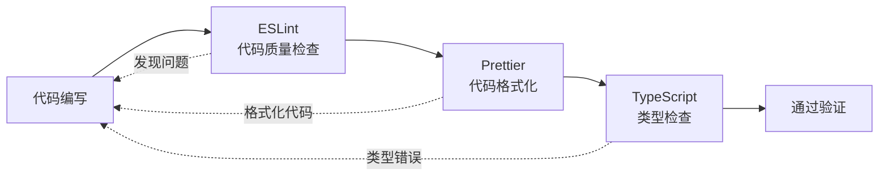
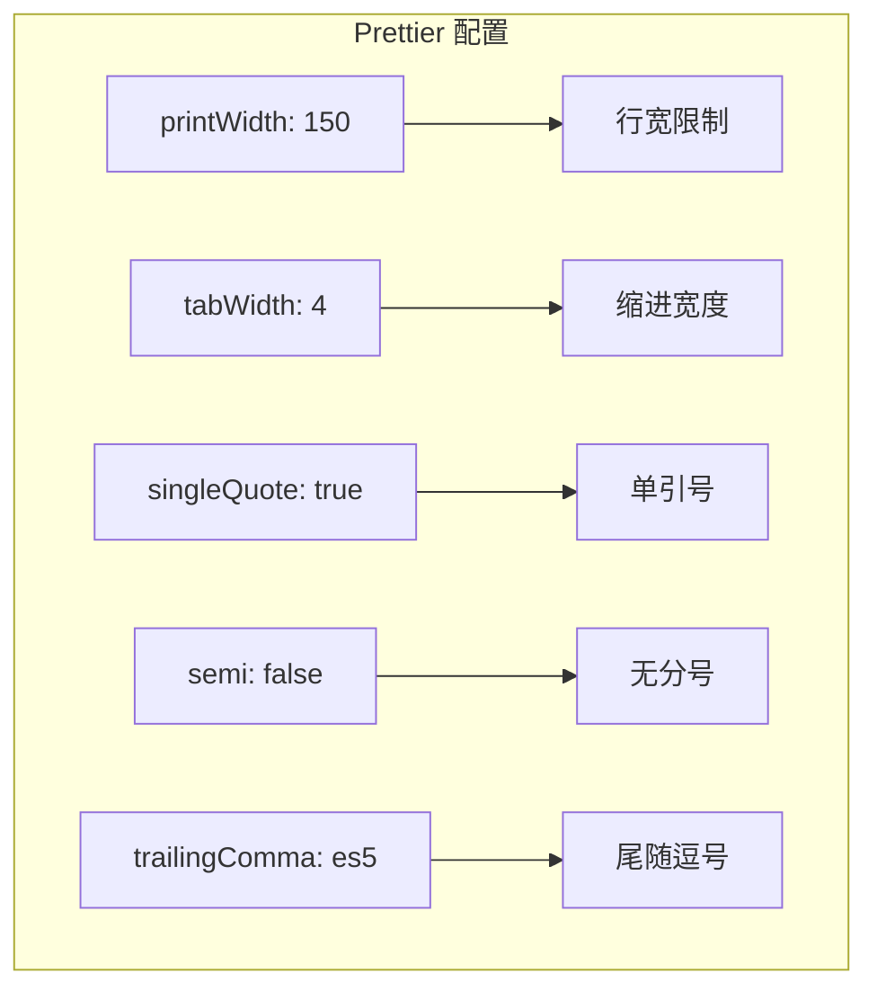
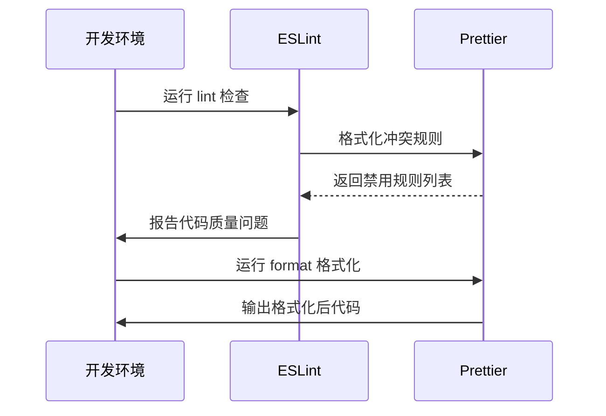
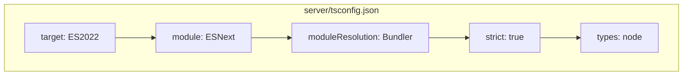
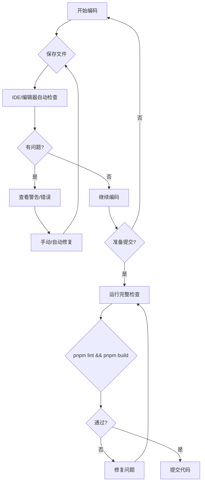

本文档介绍 admin-air 项目中的静态检查验证体系，包括代码质量检查（ESLint）、代码格式化（Prettier）和类型检查（TypeScript/vuetsc）的配置与使用方法。

## 静态检查工具概览

admin-air 项目采用了三层静态检查体系，分别负责代码风格一致性检查、代码格式化和类型安全验证。这三种工具相互配合，在开发流程的不同阶段发挥作用。



| 工具 | 作用 | 检查时机 | 修复方式 |
|------|------|----------|----------|
| ESLint | 代码质量、风格、潜在错误 | 保存时/提交前 | `lint-fix` 自动修复 |
| Prettier | 代码格式、缩进、引号 | 保存时/提交前 | `format` 自动格式化 |
| TypeScript | 类型检查、类型安全 | 编译时/构建前 | 手动修改代码 |

Sources: [server/package.json](server/package.json#L12-L15), [web/package.json](web/package.json#L7-L12)

---

## ESLint 配置详解

### 后端 ESLint 配置

后端 ESLint 配置文件位于 `server/eslint.config.js`，采用 Flat Config 格式（ESLint 10+）。该配置集成了 TypeScript 支持和 Prettier 格式化检查。

```mermaid
flowchart TB
    subgraph server/eslint.config.js
        A[基础配置] --> B[TS推荐规则]
        B --> C[全局变量Node]
        C --> D[Prettier集成]
        D --> E[自定义规则]
    end
    
    F[@eslint/js] --> A
    G[typescript-eslint] --> B
    H[eslint-config-prettier] --> D
    I[eslint-plugin-prettier] --> D
    J[globals] --> C
```

关键配置说明：

| 配置项 | 值 | 说明 |
|--------|-----|------|
| `ignores` | node_modules, dist | 忽略目录 |
| `globals.node` | 内置 globals | 提供 Node.js 全局变量 |
| `@typescript-eslint/no-unused-vars` | warn | 未使用变量警告 |
| `prettier/prettier` | warn | 格式化为 warn 级别 |

Sources: [server/eslint.config.js](server/eslint.config.js#L1-L51)

### 前端 ESLint 配置

前端 ESLint 配置位于 `web/eslint.config.js`，在后端配置基础上增加了 Vue 3 支持。该配置启用了 Vue 官方推荐规则集，并对大量 Vue 特性规则进行了关闭处理，以适应项目实际需求。

关键差异点：

| 配置项 | 后端 | 前端 |
|--------|------|------|
| `globals` | node | browser |
| Vue 支持 | 无 | eslint-plugin-vue |
| 关闭的规则 | 少 | 多（适配 Vue 项目） |
| Parser | ts.parser | ts.parser + Vue SFC |

Sources: [web/eslint.config.js](web/eslint.config.js#L1-L92)

### ESLint 规则设计理念

项目 ESLint 配置采取**宽松策略**，主要基于以下考虑：

1. **未使用变量规则降级为 warn**：以 `argsIgnorePattern: '^_'` 和 `varsIgnorePattern: '^_'` 允许下划线前缀的占位参数
2. **大量 Vue 规则关闭**：适应快速开发节奏，避免过度约束
3. **Prettier 格式化检查降级为 warn**：格式问题不阻断构建，仅作为警告提示

这种配置平衡了代码质量与开发效率，适合中大型管理后台项目的开发节奏。

Sources: [server/eslint.config.js](server/eslint.config.js#L34-L42), [web/eslint.config.js](web/eslint.config.js#L36-L77)

---

## Prettier 配置详解

### 格式化配置

项目统一使用 Prettier 进行代码格式化，前端和后端共享相同的格式化规则，配置文件分别为 `server/.prettierrc.js` 和 `web/.prettierrc.js`。



核心配置参数说明：

| 参数 | 值 | 说明 |
|------|-----|------|
| `printWidth` | 150 | 单行最大字符数 |
| `tabWidth` | 4 | 缩进宽度 |
| `useTabs` | false | 不使用 Tab 缩进 |
| `semi` | false | 语句不加分号 |
| `singleQuote` | true | 字符串使用单引号 |
| `trailingComma` | es5 | ES5 风格尾随逗号 |
| `arrowParens` | always | 箭头函数始终加括号 |
| `endOfLine` | lf | 换行符为 LF |

Sources: [server/.prettierrc.js](server/.prettierrc.js#L1-L21), [web/.prettierrc.js](web/.prettierrc.js#L1-L21)

### Prettier 与 ESLint 集成

项目通过 `eslint-config-prettier` 和 `eslint-plugin-prettier` 实现 Prettier 与 ESLint 的深度集成。这种集成方式确保了格式化规则不会与 ESLint 规则产生冲突，由 Prettier 统一处理代码格式问题。



---

## TypeScript 类型检查

### 后端 TypeScript 配置

后端 TypeScript 配置位于 `server/tsconfig.json`，启用严格模式进行类型检查。



| 配置项 | 值 | 说明 |
|--------|-----|------|
| `target` | ES2022 | 编译目标版本 |
| `module` | ESNext | 模块系统 |
| `moduleResolution` | Bundler | 模块解析策略 |
| `strict` | true | 启用严格类型检查 |
| `types` | ["node"] | 类型定义声明 |
| `skipLibCheck` | true | 跳过库检查 |
| `esModuleInterop` | true | ES 模块互操作 |

Sources: [server/tsconfig.json](server/tsconfig.json#L1-L14)

### 前端 TypeScript 配置

前端 TypeScript 配置位于 `web/tsconfig.json`，针对 Vue 3 + Vite 项目进行了优化。

| 配置项 | 值 | 说明 |
|--------|-----|------|
| `target` | ESNext | 编译目标版本 |
| `lib` | ESNext, DOM | 库类型定义 |
| `jsx` | preserve | 保留 JSX 不转换 |
| `strict` | true | 启用严格类型检查 |
| `paths` | /@/*: src/* | 路径别名 |
| `types` | vite/client, element-plus/global | 项目依赖类型 |

Sources: [web/tsconfig.json](web/tsconfig.json#L1-L25)

---

## 检查命令使用指南

### 命令速查表

| 命令 | 位置 | 作用 |
|------|------|------|
| `pnpm lint` | server/web | 运行 ESLint 检查 |
| `pnpm lint-fix` | server/web | 自动修复 ESLint 问题 |
| `pnpm format` | server/web | 运行 Prettier 格式化 |
| `pnpm build` | server | TypeScript 类型检查 |
| `pnpm typecheck` | web | Vue + TypeScript 类型检查 |

Sources: [server/package.json](server/package.json#L12-L15), [web/package.json](web/package.json#L7-L12)

### 典型使用流程



### 分步执行示例

**1. 后端检查流程：**

```bash
# 进入后端目录
cd server

# 代码质量检查
pnpm lint

# 自动修复可自动修复的问题
pnpm lint-fix

# 代码格式化
pnpm format

# TypeScript 类型检查
pnpm build
```

**2. 前端检查流程：**

```bash
# 进入前端目录
cd web

# 代码质量检查
pnpm lint

# 自动修复可自动修复的问题
pnpm lint-fix

# 代码格式化
pnpm format

# Vue + TypeScript 类型检查
pnpm typecheck
```

---

## IDE 集成建议

### VS Code 配置

建议在 VS Code 中安装以下插件并配置自动修复：

1. **ESLint** (dbaeumer.vscode-eslint) - 代码质量检查
2. **Prettier - Code formatter** (esbenp.prettier-vscode) - 代码格式化
3. **Volar** (Vue.volar) - Vue 语言支持（前端）

推荐 VS Code 设置配置：

```json
{
  "editor.formatOnSave": true,
  "editor.codeActionsOnSave": {
    "source.fixAll.eslint": "explicit",
    "source.organizeImports": "explicit"
  },
  "editor.defaultFormatter": "esbenp.prettier-vscode",
  "[typescript]": {
    "editor.defaultFormatter": "esbenp.prettier-vscode"
  },
  "[vue]": {
    "editor.defaultFormatter": "Vue.volar"
  }
}
```

---

## 验证检查结果解读

### ESLint 输出示例

```bash
$ pnpm lint

/web/src/api/user.ts
  22:7  warning  'createUser' is defined but never used  @typescript-eslint/no-unused-vars
  35:2  warning  Insert `;`                          prettier/prettier

✖ 2 problems (0 errors, 2 warnings)
```

| 级别 | 代码 | 含义 | 是否阻断构建 |
|------|------|------|--------------|
| Error | ✖ | 严重问题 | 阻断 |
| Warning | △ | 轻微问题 | 不阻断 |

### TypeScript 错误示例

```bash
$ pnpm build

src/modules/admin/user.ts:15:14 - error TS2339: Property 'name' does not exist on type 'User'
```

遇到此类错误需要根据 TypeScript 提示手动修改代码以符合类型定义，这是静态检查的最后一道防线。

---

## 下一步

静态检查验证通过后，建议进行以下步骤：

1. **浏览器E2E验证** - 进行端到端功能测试验证
2. **ESLint与Prettier配置** - 深入了解代码规范配置细节

如需了解项目完整的编码规范体系，请参阅 [ESLint与Prettier配置](26-eslintyu-prettierpei-zhi)。