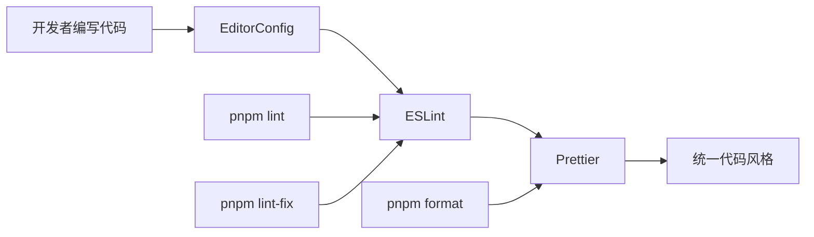
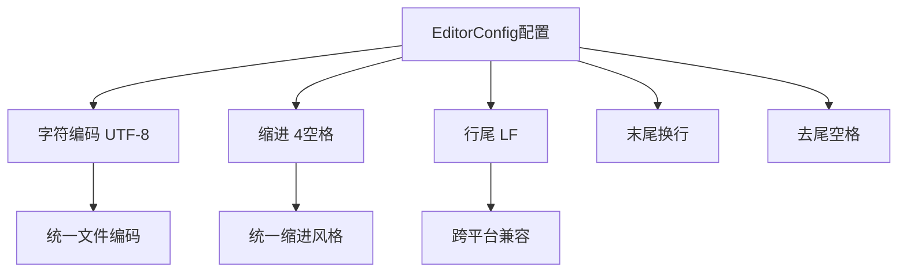
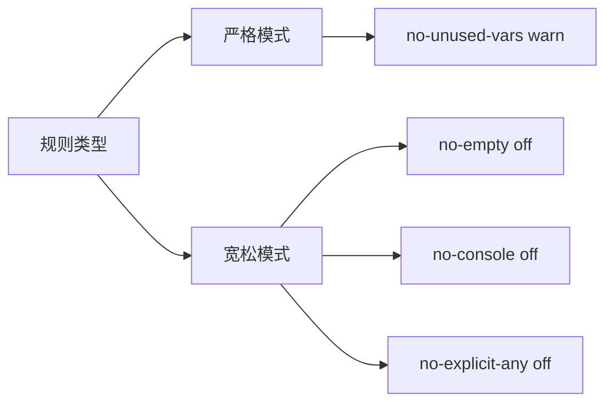
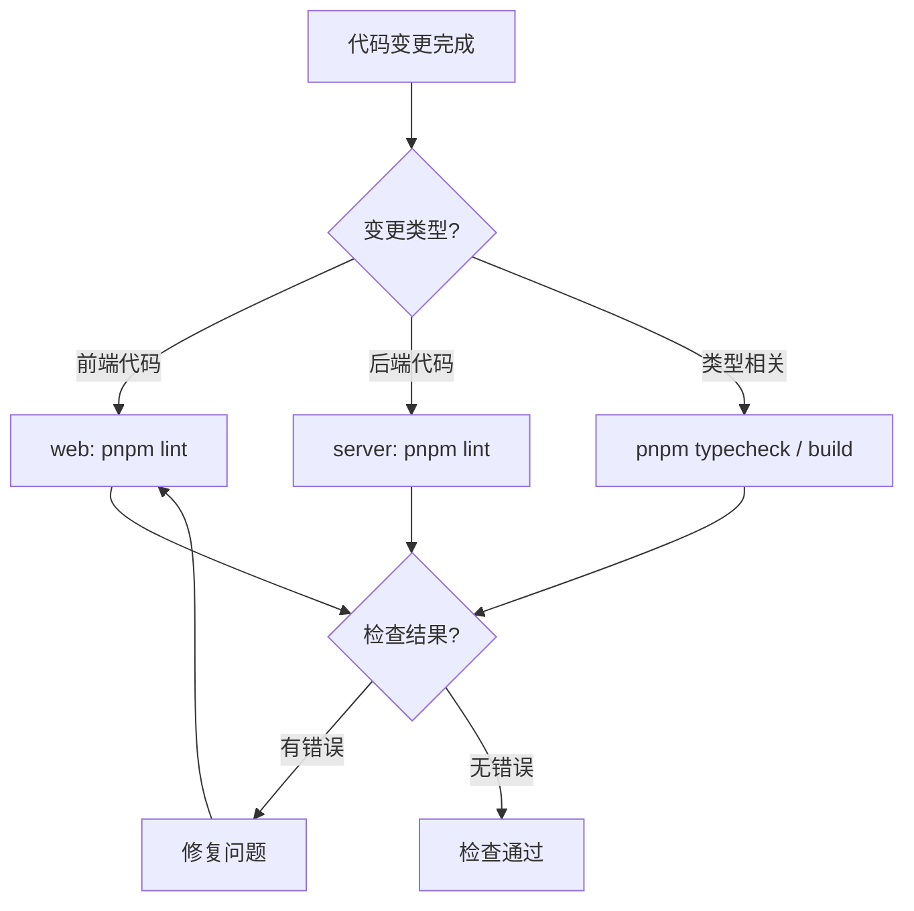

本页面为开发人员提供项目代码规范的全面概述，涵盖代码质量工具链架构、编辑器配置、代码检查规则和格式化标准。理解这些规范有助于保持团队代码风格一致性，提高代码可维护性。

## 代码质量工具链架构

项目采用三层代码质量保障体系：EditorConfig 提供基础编辑器配置，ESLint 进行代码检查，Prettier 实现自动化格式化。三者协同工作，形成从编辑器到构建流程的完整质量控制闭环。



| 工具 | 作用 | 配置文件 |
|------|------|----------|
| EditorConfig | 统一编辑器基础配置 | `.editorconfig` |
| ESLint | 代码检查与问题检测 | `eslint.config.js` |
| Prettier | 代码自动化格式化 | `.prettierrc.js` |

Sources: [.editorconfig](.editorconfig#L1-L16), [server/eslint.config.js](server/eslint.config.js#L1-L51), [web/eslint.config.js](web/eslint.config.js#L1-L92)

## EditorConfig 编辑器配置

EditorConfig 为项目定义统一的基础编辑器行为，确保不同开发者在不同编辑器中保持一致的编码体验。这些设置在打开文件时自动生效，无需额外配置。



**核心配置项说明**：

| 配置项 | 值 | 说明 |
|--------|-----|------|
| charset | utf-8 | 统一文件字符编码为 UTF-8 |
| indent_style | space | 使用空格而非 Tab 进行缩进 |
| indent_size | 4 | 缩进宽度为 4 个空格 |
| end_of_line | lf | 行尾使用 LF（Unix 风格） |
| insert_final_newline | true | 文件末尾插入新行 |
| trim_trailing_whitespace | true | 去除行尾多余空格 |

**特殊规则**：Markdown 文件（`*.md`）使用 Tab 缩进，不强制末尾换行，以适应文档写作习惯。

Sources: [.editorconfig](.editorconfig#L1-L16)

## ESLint 代码检查

ESLint 是项目的核心代码检查工具，通过预定义的规则集检测代码中的语法错误、潜在问题和不符合规范的做法。项目的 ESLint 配置整合了 TypeScript ESLint、Vue 插件和 Prettier 集成。

### 前端与后端配置对比

| 特性 | 后端 (server) | 前端 (web) |
|------|--------------|------------|
| 基础配置 | @eslint/js + typescript-eslint | @eslint/js + typescript-eslint |
| 框架支持 | 纯 TypeScript | TypeScript + Vue 3 |
| Vue 插件 | 不适用 | eslint-plugin-vue |
| 全局环境 | node | browser |

### 核心规则说明

项目根据实际开发需求，对部分 ESLint 规则进行了调整以平衡代码质量与开发效率：



**关闭的规则**（提升开发效率）：
- `no-empty`：允许空代码块
- `no-undef`：允许未声明的全局变量（配合框架）
- `no-console`：允许控制台输出
- `@typescript-eslint/no-explicit-any`：允许使用 any 类型

**保留的规则**（保证代码质量）：
- `no-unused-vars`：警告未使用的变量（但忽略下划线开头参数）

Sources: [server/eslint.config.js](server/eslint.config.js#L1-L51), [web/eslint.config.js](web/eslint.config.js#L1-L92)

## Prettier 代码格式化

Prettier 负责将代码格式化为统一风格，作为 ESLint 的补充处理代码美观问题。项目的前端和后端共享相同的格式化配置。

### 格式化规则总览

| 配置项 | 值 | 说明 |
|--------|-----|------|
| printWidth | 150 | 单行最大字符数 |
| tabWidth | 4 | 缩进宽度 |
| useTabs | false | 使用空格缩进 |
| semi | false | 不使用分号 |
| singleQuote | true | 使用单引号 |
| quoteProps | as-needed | 对象属性引号按需添加 |
| trailingComma | es5 | ES5 风格尾随逗号 |
| bracketSpacing | true | 对象括号内空格 |
| arrowParens | always | 箭头函数始终加括号 |
| endOfLine | lf | 行尾使用 LF |

### 格式化与 ESLint 集成

项目将 Prettier 深度集成到 ESLint 中，通过 `eslint-plugin-prettier` 在 ESLint 检查时直接运行 Prettier，格式化问题会以警告形式显示：

```javascript
// ESLint 中 Prettier 规则配置
{
    files: ['**/*.{ts,tsx,js,mjs,cjs}'],
    rules: {
        'prettier/prettier': [
            'warn',
            {
                endOfLine: 'auto', // 允许自动适配系统行尾
            },
        ],
    },
}
```

Sources: [server/.prettierrc.js](server/.prettierrc.js#L1-L21), [web/.prettierrc.js](web/.prettierrc.js#L1-L21)

## 常用规范命令

项目在 `package.json` 中定义了标准化的规范检查命令，可在对应目录下执行：

### 前端命令（web 目录）

```bash
pnpm lint        # 运行 ESLint 检查
pnpm lint-fix    # 自动修复 ESLint 可修复问题
pnpm format      # 运行 Prettier 格式化
pnpm typecheck   # TypeScript 类型检查
```

### 后端命令（server 目录）

```bash
pnpm lint        # 运行 ESLint 检查
pnpm lint-fix    # 自动修复 ESLint 可修复问题
pnpm format      # 运行 Prettier 格式化
pnpm build       # TypeScript 编译检查
```

Sources: [server/package.json](server/package.json#L1-L41#L8-L10), [web/package.json](web/package.json#L1-L59#L8-L12)

## 规范化检查流程

遵循项目开发工作流中的验证要求，在提交代码前应执行规范化检查。不同类型的变更需要运行不同的检查命令。



**检查优先级**：
1. **必须执行**：ESLint 检查（`pnpm lint`）
2. **强烈建议**：格式化（`pnpm format`）确保代码风格统一
3. **类型检查**：根据变更位置选择 `pnpm typecheck`（前端）或 `pnpm build`（后端）

Sources: [docs/development-workflow.md](docs/development-workflow.md#L107-L116)

## 下一步学习

完成本页面学习后，建议继续深入了解具体的配置细节：

- [ESLint与Prettier配置](26-eslintyu-prettierpei-zhi) — 深入了解 ESLint 和 Prettier 的规则细节与自定义配置方式

如需了解如何在实际开发中应用这些规范，可查阅：

- [代码质量检查](19-dai-ma-zhi-liang-jian-cha) — 规范化检查命令的实际使用场景
- [首次启动流程](20-shou-ci-qi-dong-liu-cheng) — 项目启动时的完整环境配置