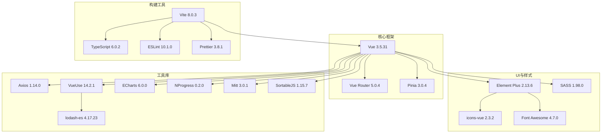
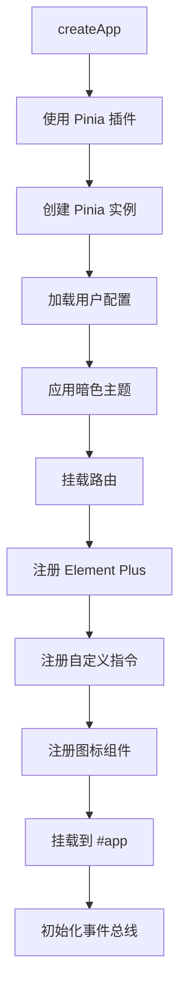

本文档详细介绍 admin-air 项目的前端技术栈与核心依赖，帮助开发者理解项目所使用的技术方案及其在实际开发中的应用方式。

## 技术栈概览

admin-air 前端采用现代化的 Vue 3 生态技术栈构建，集成了路由管理、状态管理、UI 组件库、HTTP 请求等多个核心模块。以下是项目的整体技术架构图：



## 核心依赖详解

### 1. 框架与路由状态管理

| 依赖包 | 版本 | 用途说明 |
|--------|------|----------|
| **vue** | 3.5.31 | 核心框架，组合式 API |
| **vue-router** | 5.0.4 | 路由管理，支持哈希模式 |
| **pinia** | 3.0.4 | 状态管理，替代 Vuex |
| **pinia-plugin-persistedstate** | 4.7.1 | Pinia 持久化插件 |

本项目使用 Vue 3 的组合式 API (Composition API) 进行开发，路由采用哈希模式 (`createWebHashHistory`)，避免服务端配置即可运行。状态管理采用 Pinia，它是 Vue 官方推荐的新一代状态管理库，相比 Vuex 更加轻量且支持 TypeScript。

**路由配置示例**（`web/src/router/index.ts`）：
```typescript
const router = createRouter({
    history: createWebHashHistory(),
    routes: staticRoutes,
})
```

**Pinia 初始化**（`web/src/stores/index.ts`）：
```typescript
import { createPinia } from 'pinia'
import piniaPluginPersistedstate from 'pinia-plugin-persistedstate'

const pinia = createPinia()
pinia.use(piniaPluginPersistedstate)
```

Sources: [package.json](web/package.json#L19-L22), [router/index.ts](web/src/router/index.ts#L1-L10), [stores/index.ts](web/src/stores/index.ts#L1-L8)

### 2. UI 组件库

| 依赖包 | 版本 | 用途说明 |
|--------|------|----------|
| **element-plus** | 2.13.6 | UI 组件库 |
| **@element-plus/icons-vue** | 2.3.2 | Element Plus 图标库 |
| **font-awesome** | 4.7.0 | 额外图标支持 |

项目使用 Element Plus 作为主要 UI 组件库，提供了丰富的桌面端组件如表格、表单、对话框、导航菜单等。图标系统采用 Element Plus 内置图标与 Font Awesome 结合的双图标方案。

**在 main.ts 中的初始化**：
```typescript
import ElementPlus from 'element-plus'
import 'element-plus/dist/index.css'
import 'element-plus/theme-chalk/display.css'
import 'font-awesome/css/font-awesome.min.css'

app.use(ElementPlus)
```

Sources: [package.json](web/package.json#L8-L10), [main.ts](web/src/main.ts#L1-L18)

### 3. HTTP 请求与工具库

| 依赖包 | 版本 | 用途说明 |
|--------|------|----------|
| **axios** | 1.14.0 | HTTP 客户端 |
| **@vueuse/core** | 14.2.1 | Vue 组合式工具库 |
| **lodash-es** | 4.17.23 | JavaScript 工具函数 |
| **mitt** | 3.0.1 | 事件总线 |
| **echarts** | 6.0.0 | 图表可视化 |
| **nprogress** | 0.2.0 | 页面加载进度条 |

项目对 Axios 进行了深度封装，实现了一个功能完善的 HTTP 请求模块，包括请求拦截、响应拦截、错误处理、请求取消、令牌刷新等功能。

**请求拦截器核心逻辑**（`web/src/utils/axios.ts`）：
```typescript
Axios.interceptors.request.use((requestConfig) => {
    removePending(requestConfig)
    options.cancelDuplicateRequest && addPending(requestConfig)
    // 添加 token 到请求头
    const token = options.anotherToken || adminInfo.getToken()
    if (token) (requestConfig.headers as anyObj).batoken = token
    return requestConfig
})

Axios.interceptors.response.use((response) => {
    // 处理业务错误码
    if (response.data.code !== 1) {
        if (response.data.code === 303 || response.data.code === 401) {
            adminInfo.removeToken()
            router.push({ name: 'adminLogin' })
        }
    }
    return options.reductDataFormat ? response.data : response
})
```

Sources: [package.json](web/package.json#L11-L17), [axios.ts](web/src/utils/axios.ts#L32-L80)

### 4. 构建与开发工具

| 依赖包 | 版本 | 用途说明 |
|--------|------|----------|
| **vite** | 8.0.3 | 开发服务器与构建工具 |
| **typescript** | 6.0.2 | JavaScript 超集 |
| **vue-tsc** | 3.2.6 | Vue 类型检查 |
| **eslint** | 10.1.0 | 代码质量检查 |
| **prettier** | 3.8.1 | 代码格式化 |
| **sass** | 1.98.0 | CSS 预处理器 |
| **esno** | 4.8.0 | TypeScript 运行时 |

Vite 是项目的核心构建工具，提供极快的冷启动和热更新体验。项目使用 TypeScript 进行类型安全开发，通过 `vue-tsc` 进行类型检查，ESLint 和 Prettier 确保代码风格统一。

**Vite 配置要点**（`web/vite.config.ts`）：
```typescript
export default viteConfig(({ mode }: ConfigEnv): UserConfig => {
    return {
        plugins: [vue(), svgBuilder('./src/assets/icons/'), customHotUpdate()],
        resolve: { alias: { '/@': pathResolve('./src/') } },
        server: {
            port: parseInt(VITE_PORT, 10),
            proxy: {
                '/api': { target: 'http://127.0.0.1:8787' },
                '/admin': { target: 'http://127.0.0.1:8787' },
            },
        },
    }
})
```

Sources: [package.json](web/package.json#L26-L44), [vite.config.ts](web/vite.config.ts#L30-L60)

## 项目初始化流程

以下是前端应用启动时的完整初始化流程：



**main.ts 启动入口**（`web/src/main.ts`）：
```typescript
async function start() {
    const app = createApp(App)
    app.use(pinia)

    const config = useConfig(pinia)
    updateHtmlDarkClass(config.layout.isDark)

    app.use(router)
    app.use(ElementPlus)

    directives(app)
    registerIcons(app)

    app.mount('#app')
    app.config.globalProperties.eventBus = mitt()
}

start()
```

Sources: [main.ts](web/src/main.ts#L15-L34)

## 自定义指令系统

项目封装了多个 Vue 自定义指令以简化常见功能实现：

| 指令名称 | 用法示例 | 功能说明 |
|----------|----------|----------|
| **v-auth** | `v-auth="'add'"` | 页面按钮权限控制 |
| **v-drag** | `v-drag="['.dom', '.handle']"` | 元素拖拽功能 |
| **v-zoom** | `v-zoom="'.dialog'"` | 对话框缩放功能 |
| **v-blur** | `v-blur` | 聚焦后自动失焦 |
| **v-table-lateral-drag** | `v-table-lateral-drag` | 表格横向滚动拖拽 |

**指令注册**（`web/src/utils/directives.ts`）：
```typescript
export function directives(app: App) {
    authDirective(app)      // 鉴权指令
    dragDirective(app)      // 拖动指令
    zoomDirective(app)      // 缩放指令
    blurDirective(app)     // 点击后自动失焦指令
    tableLateralDragDirective(app)  // 表格横向拖动指令
}
```

Sources: [directives.ts](web/src/utils/directives.ts#L1-L14)

## 状态管理 store 结构

项目使用 Pinia 管理多个独立状态模块：

| Store 名称 | 用途 | 文件位置 |
|------------|------|----------|
| **adminInfo** | 管理员信息与令牌 | `stores/adminInfo.ts` |
| **config** | 布局与主题配置 | `stores/config.ts` |
| **menuSearch** | 菜单搜索功能 | `stores/menuSearch.ts` |
| **navTabs** | 导航标签页管理 | `stores/navTabs.ts` |
| **siteConfig** | 站点配置 | `stores/siteConfig.ts` |

以 `config` store 为例，包含主题切换、布局模式、菜单配置等丰富选项：

```typescript
const layout: Layout = reactive({
    showDrawer: false,
    shrink: false,
    layoutMode: 'Default',
    isDark: false,
    menuWidth: 260,
    menuCollapse: false,
    // ... 更多配置项
})
```

Sources: [stores/config.ts](web/src/stores/config.ts#L1-L30)

## TypeScript 配置

项目配置了完整的 TypeScript 支持，主要编译选项如下（`web/tsconfig.json`）：

```json
{
    "compilerOptions": {
        "target": "ESNext",
        "module": "ESNext",
        "strict": true,
        "moduleResolution": "Bundler",
        "paths": { "/@/*": ["src/*"] },
        "types": ["vite/client", "element-plus/global"]
    }
}
```

Sources: [tsconfig.json](web/tsconfig.json#L1-L25)

## 依赖版本锁定

项目使用 pnpm 作为包管理工具，并在 `package.json` 中配置了仅在特定依赖项上进行构建：

```json
"pnpm": {
    "onlyBuiltDependencies": [
        "@parcel/watcher",
        "esbuild",
        "vue-demi"
    ]
}
```

Sources: [package.json](web/package.json#L50-L57)

## 下一步学习路径

完成本篇技术栈与依赖的学习后，建议按顺序阅读以下文档深入了解项目：

- **[前端路由与鉴权](4-qian-duan-lu-you-yu-jian-quan)** - 了解路由配置与权限验证机制
- **[前端状态管理](5-qian-duan-zhuang-tai-guan-li)** - 深入学习各 store 模块的设计
- **[前端组件与布局](6-qian-duan-zu-jian-yu-bu-ju)** - 掌握项目中的核心组件用法
- **[前端构建配置](11-qian-duan-gou-jian-pei-zhi)** - 学习 Vite 详细配置与优化
- **[前端请求封装](14-qian-duan-qing-qiu-feng-zhuang)** - 深入理解 HTTP 请求模块设计