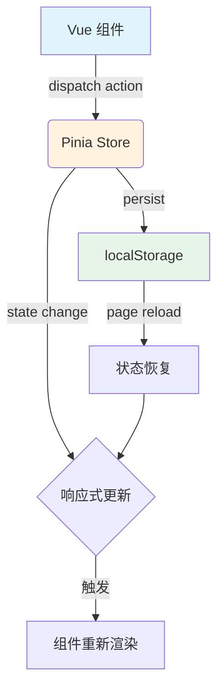

本文档详细介绍 admin-air 项目中前端状态管理的架构设计与实现方案。状态管理采用 **Pinia** 作为核心框架，结合 **pinia-plugin-persistedstate** 插件实现数据持久化。

## 架构概览

```
┌─────────────────────────────────────────────────────────────────┐
│                         Pinia Store                              │
│  ┌─────────────┐  ┌─────────────┐  ┌─────────────┐             │
│  │   config    │  │  adminInfo  │  │  navTabs    │             │
│  │  布局配置   │  │  用户信息   │  │  标签页    │             │
│  └─────────────┘  └─────────────┘  └─────────────┘             │
│  ┌─────────────┐  ┌─────────────┐  ┌─────────────┐             │
│  │ siteConfig  │  │ menuSearch  │  │    refs     │             │
│  │ 站点配置    │  │  菜单搜索   │  │  组件引用   │             │
│  └─────────────┘  └─────────────┘  └─────────────┘             │
│                                                                 │
│  ┌─────────────────────────────────────────────────────────┐   │
│  │         pinia-plugin-persistedstate                      │   │
│  │                    (数据持久化)                           │   │
│  └─────────────────────────────────────────────────────────┘   │
│                              │                                   │
│                              ▼                                   │
│                    localStorage / sessionStorage                 │
└─────────────────────────────────────────────────────────────────┘
```

## 核心技术栈

| 技术 | 版本 | 用途 |
|------|------|------|
| Pinia | 3.0.4 | Vue 3 官方推荐状态管理库 |
| pinia-plugin-persistedstate | 4.7.1 | 状态持久化插件 |
| Vue | 3.5.31 | 响应式框架 |

Sources: [package.json](web/package.json#L23-L24)

## 目录结构

```
web/src/stores/
├── index.ts                    # Pinia 主入口
├── config.ts                   # 布局与CRUD配置
├── adminInfo.ts                # 管理员用户信息
├── navTabs.ts                  # 导航标签页状态
├── menuSearch.ts               # 菜单搜索面板
├── siteConfig.ts               # 站点全局配置
├── refs.ts                     # 全局组件引用
├── constant/
│   ├── cacheKey.ts             # 存储键常量定义
│   ├── common.ts               # 通用常量
│   └── terminalTaskStatus.ts   # 终端任务状态常量
└── interface/
    └── index.ts                # 类型接口定义
```

Sources: [web/src/stores/](web/src/stores)

## 初始化配置

在应用入口 `main.ts` 中，Pinia 被初始化并配置了持久化插件：

```typescript
// web/src/main.ts
import pinia from '/@/stores/index'

async function start() {
    const app = createApp(App)
    app.use(pinia)
    // ... 其他配置
}
```

Pinia 主入口文件同时注册了持久化插件：

```typescript
// web/src/stores/index.ts
import { createPinia } from 'pinia'
import piniaPluginPersistedstate from 'pinia-plugin-persistedstate'

const pinia = createPinia()
pinia.use(piniaPluginPersistedstate)

export default pinia
```

Sources: [main.ts](web/src/main.ts#L1-L34)
Sources: [index.ts](web/src/stores/index.ts#L1-L8)

## 核心 Store 详解

### 1. 配置管理 (config Store)

管理全局布局配置和 CRUD 操作设置，使用 **Setup 风格**定义：

```typescript
// 使用 setup 语法糖定义 store
export const useConfig = defineStore(
    'config',
    () => {
        // 响应式布局配置
        const layout: Layout = reactive({...})
        
        // CRUD 配置
        const crud: Crud = reactive({...})
        
        // 计算菜单宽度
        function menuWidth() {...}
        
        // 设置布局模式
        function setLayoutMode(_data: string) {...}
        
        return { layout, crud, menuWidth, setLayoutMode, ... }
    },
    {
        persist: { key: STORE_CONFIG }
    }
)
```

**布局配置项**：

| 配置项 | 类型 | 说明 |
|--------|------|------|
| isDark | boolean | 深色模式开关 |
| menuCollapse | boolean | 菜单折叠状态 |
| menuWidth | number | 菜单宽度 |
| layoutMode | string | 布局模式 (Default/Classic) |
| mainAnimation | string | 主体动画效果 |

**CRUD 配置项**：

| 配置项 | 类型 | 可选值 |
|--------|------|--------|
| syncType | string | manual / automatic |
| syncedUpdate | string | yes / no |
| syncAutoPublic | string | no / yes |

Sources: [config.ts](web/src/stores/config.ts#L1-L93)
Sources: [interface/index.ts](web/src/stores/interface/index.ts#L1-L69)

### 2. 用户信息管理 (adminInfo Store)

管理当前登录用户的信息和认证令牌，采用 **Options 风格**定义：

```typescript
export const useAdminInfo = defineStore('adminInfo', {
    state: (): AdminInfo => ({
        id: 0,
        username: '',
        nickname: '',
        avatar: '',
        token: '',
        refresh_token: '',
        super: false,
    }),
    actions: {
        // 批量填充状态
        dataFill(state, exclude = true) {...},
        // 设置令牌
        setToken(token, type: 'auth' | 'refresh') {...},
        // 获取令牌
        getToken(type = 'auth') {...},
    },
    persist: { key: ADMIN_INFO }
})
```

**关键特性**：
- `dataFill` 方法支持排除特定字段（如 token）进行状态更新
- 支持分别管理认证令牌和刷新令牌
- 持久化存储用户登录状态

Sources: [adminInfo.ts](web/src/stores/adminInfo.ts#L1-L58)

### 3. 导航标签页管理 (navTabs Store)

管理多标签页导航状态，支持标签页的增删改查：

```typescript
export const useNavTabs = defineStore(
    'navTabs',
    () => {
        const state: NavTabs = reactive({
            activeIndex: 0,
            activeRoute: null,
            tabsView: [],
            tabFullScreen: false,
            tabsViewRoutes: [],
            authNode: new Map(),
        })
        
        // 核心方法
        const _addTab = (route) => {...}
        const _closeTab = (route) => {...}
        const _setActiveRoute = (route) => {...}
        
        return { state, _addTab, _closeTab, ... }
    },
    {
        persist: {
            key: STORE_TAB_VIEW_CONFIG,
            pick: ['state.tabFullScreen'],  // 仅持久化全屏状态
        }
    }
)
```

**状态结构**：

| 属性 | 类型 | 说明 |
|------|------|------|
| activeIndex | number | 当前激活标签索引 |
| activeRoute | RouteLocationNormalized | 当前路由信息 |
| tabsView | RouteLocationNormalized[] | 标签页列表 |
| tabFullScreen | boolean | 全屏状态 |
| tabsViewRoutes | RouteRecordRaw[] | 路由配置副本 |
| authNode | Map | 权限节点映射 |

Sources: [navTabs.ts](web/src/stores/navTabs.ts#L1-L177)

### 4. 菜单搜索面板 (menuSearch Store)

管理全局菜单搜索面板的开关状态，使用 **浅层响应式** 优化性能：

```typescript
export const useMenuSearchPanel = defineStore('menuSearchPanel', () => {
    const isOpen = shallowRef(false)  // 浅层响应式
    
    const open = () => { isOpen.value = true }
    const close = () => { isOpen.value = false }
    const toggle = (status?: boolean) => {
        isOpen.value = typeof status === 'boolean' ? status : !isOpen.value
    }
    
    return { isOpen, open, close, toggle }
})
```

**设计特点**：使用 `shallowRef` 避免深层响应式开销

Sources: [menuSearch.ts](web/src/stores/menuSearch.ts#L1-L26)

### 5. 站点配置 (siteConfig Store)

管理站点全局配置信息：

```typescript
export const useSiteConfig = defineStore('siteConfig', {
    state: (): SiteConfig => ({
        siteName: '',
        version: '',
        cdnUrl: '',
        apiUrl: '',
        upload: { mode: 'local' },
        headNav: [],
        initialize: false,
        initializeFailed: false,
        userInitialize: false,
    }),
    actions: {
        dataFill(state) {...},
        setHeadNav(headNav) {...},
        setInitialize(initialize) {...},
    }
})
```

Sources: [siteConfig.ts](web/src/stores/siteConfig.ts#L1-L47)

### 6. 组件引用管理 (refs Store)

管理全局组件实例引用（非状态管理，仅提供组件句柄）：

```typescript
// 全局提供：引用（指向）一些对象（组件）的句柄
export const layoutNavTabsRef = ref<InstanceType<typeof NavTabs>>()
export const layoutMainScrollbarRef = ref<ScrollbarInstance>()
export const layoutMenuRef = ref<ScrollbarInstance>()
export const layoutMenuScrollbarRef = ref<ScrollbarInstance>()
```

Sources: [refs.ts](web/src/stores/refs.ts#L1-L35)

## 持久化策略

存储键统一在 `cacheKey.ts` 中定义：

```typescript
// web/src/stores/constant/cacheKey.ts
export const ADMIN_INFO = 'adminInfo'
export const STORE_CONFIG = 'storeConfig_v2'
export const STORE_TAB_VIEW_CONFIG = 'storeTabViewConfig'
```

| Store | 存储键 | 持久化内容 |
|-------|--------|------------|
| config | storeConfig_v2 | 完整状态 |
| adminInfo | adminInfo | 完整状态 |
| navTabs | storeTabViewConfig | 仅 tabFullScreen |
| menuSearch | - | 无 |
| siteConfig | - | 无 |

**持久化配置选项**：
- `key`: 存储到 localStorage 的键名
- `pick`: 仅持久化指定属性（如 `navTabs` 仅持久化全屏状态）
- `exclude`: 排除指定属性

Sources: [cacheKey.ts](web/src/stores/constant/cacheKey.ts#L1-L6)

## 数据流示意



## 使用示例

### 在组件中使用 Store

```typescript
import { useConfig } from '/@/stores/config'
import { useAdminInfo } from '/@/stores/adminInfo'

const config = useConfig()
const adminInfo = useAdminInfo()

// 读取状态
const isDark = config.layout.isDark
const username = adminInfo.username

// 修改状态
config.layout.isDark = true
adminInfo.setToken('new-token', 'auth')
```

### 在非组件文件中使用

```typescript
// 在 api 请求封装中使用
import { useAdminInfo } from '/@/stores/adminInfo'

export function getUserInfo() {
    const adminInfo = useAdminInfo()
    return request({
        url: '/user/info',
        headers: { Authorization: adminInfo.getToken() }
    })
}
```

## 进阶话题

### 状态管理最佳实践

| 原则 | 说明 |
|------|------|
| **按域划分** | 不同业务域使用独立 Store |
| **避免嵌套** | 优先使用扁平化状态结构 |
| **计算属性** | 复杂派生状态使用 getter |
| **Actions 封装** | 业务逻辑封装在 actions 中 |
| **按需持久化** | 仅持久化必要状态 |

### Setup vs Options 风格对比

| 特性 | Setup 风格 | Options 风格 |
|------|------------|--------------|
| 定义方式 | `defineStore(id, () => {...})` | `defineStore(id, {...})` |
| 状态 | `const xxx = ref()` | `state() {...}` |
| 计算 | `const computedX = computed(...)` | `getters: {...}` |
| 方法 | `function fn() {...}` | `actions: {...}` |
| 适用场景 | 复杂逻辑 Store | 简单状态管理 |

本项目 **config** 和 **navTabs** 使用 Setup 风格（支持更复杂的计算逻辑），其他 Store 使用 Options 风格。

Sources: [config.ts](web/src/stores/config.ts#L1-L93)
Sources: [navTabs.ts](web/src/stores/navTabs.ts#L1-L177)

## 相关文档

- [前端路由与鉴权](4-qian-duan-lu-you-yu-jian-quan) - 路由守卫与状态联动
- [前端组件与布局](6-qian-duan-zu-jian-yu-bu-ju) - 布局组件与状态交互
- [前端请求封装](14-qian-duan-qing-qiu-feng-zhuang) - 请求拦截器与 token 管理