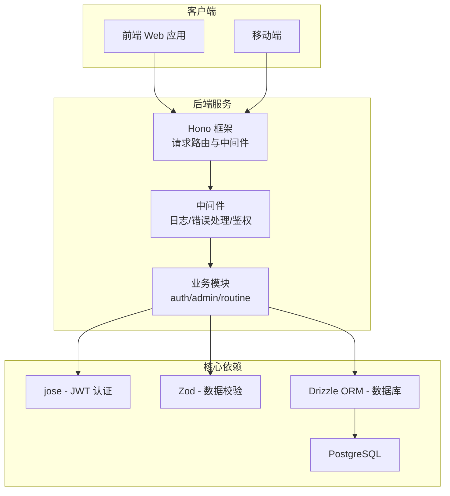
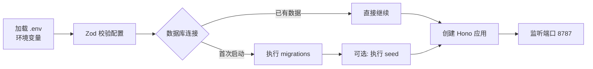

本页面详细介绍 admin-air 项目后端的技术选型、核心依赖及其架构设计，帮助开发者理解后端系统的技术基础。

## 技术架构概览

admin-air 后端采用现代化的 TypeScript 技术栈，基于 **Hono** 轻量级 Web 框架构建，结合 **Drizzle ORM** 实现数据库操作，整体架构遵循简洁高效的设计原则。



## 核心依赖详解

### Web 框架：Hono

**Hono** 是一个轻量级、快速的 Web 框架，专为边缘计算设计，但在普通 Node.js 环境中同样表现出色。在 admin-air 中，Hono 承担了路由管理、中间件编排和请求处理的核心职能。

```typescript
// server/src/app.ts - Hono 基础用法示例
import { Hono } from 'hono'
import type { AppEnv } from './shared/http/types'

export const createApp = () => {
    const app = new Hono<AppEnv>()

    // 请求日志中间件
    app.use('*', async (c, next) => {
        const startedAt = Date.now()
        await next()
        const durationMs = Date.now() - startedAt
        console.log(`[请求日志] ${c.req.method} ${c.req.url} -> ${c.res.status} (${durationMs}ms)`)
    })

    // 错误处理中间件
    app.onError((error, c) => {
        console.error(error)
        return fail(c, error.message || '服务器内部错误')
    })

    // 路由注册
    app.route('/', authRoutes())
    app.route('/', adminRoutes())

    return app
}
```

Hono 的选择体现了项目对性能的小号追求——它比传统框架更轻量，同时保持完整的 RESTful API 能力。Sources: [app.ts](server/src/app.ts#L1-L56)

### 数据库层：Drizzle ORM + PostgreSQL

数据库技术选型采用 **PostgreSQL** 配合 **Drizzle ORM**，这是一种现代化的数据库访问方案，兼具类型安全和 SQL 控制能力。

```typescript
// server/src/db/client.ts - Drizzle 数据库客户端
import postgres from 'postgres'
import { drizzle } from 'drizzle-orm/postgres-js'
import { env } from '../config/env'
import * as schema from './schema'

export const sql = postgres(env.databaseUrl, {
    max: 10,  // 连接池最大连接数
})

export const db = drizzle(sql, { schema })
```

Drizzle 相比传统 ORM（如 Sequelize、TypeORM）更加轻量，支持类型推断，且迁移工具非常成熟。项目使用 Drizzle Kit 进行数据库 schema 管理，通过 `db:generate` 和 `db:migrate` 命令完成数据库迁移。Sources: [client.ts](server/src/db/client.ts#L1-L11)

数据库 Schema 定义位于 `server/src/db/schema/` 目录，包含以下核心表：

| Schema 文件 | 用途 |
|------------|------|
| `admins.ts` | 管理员账户信息 |
| `groups.ts` | 用户组与权限组 |
| `rules.ts` | 细粒度权限规则 |
| `sessions.ts` | 会话管理 |
| `attachments.ts` | 文件附件存储 |
| `admin-logs.ts` | 操作日志记录 |

Sources: [schema/index.ts](server/src/db/schema/index.ts#L1-L10)

### 认证与安全：JWT + jose

用户认证采用 **JWT (JSON Web Token)** 标准，使用 `jose` 库实现。系统设计了双 Token 机制——Access Token 和 Refresh Token，以平衡安全性和用户体验。

```typescript
// server/src/config/env.ts - JWT 配置
const schema = z.object({
    JWT_SECRET: z.string().min(16).default('replace-with-a-long-random-string'),
    JWT_REFRESH_SECRET: z.string().min(16).default('replace-with-another-long-random-string'),
})

export const env = {
    // Access Token 有效期 2 小时
    accessTokenTtlSeconds: 60 * 60 * 2,
    // Refresh Token 有效期 7 天
    refreshTokenTtlSeconds: 60 * 60 * 24 * 7,
} as const
```

Token 的签发和验证逻辑封装在 `server/src/shared/security/` 目录中，支持 Token 刷新机制。Sources: [env.ts](server/src/config/env.ts#L1-L40)

### 数据校验：Zod

**Zod** 是 TypeScript 优先的数据校验库，用于验证请求参数、配置和环境变量。在 admin-air 中，Zod 主要用于环境配置校验和接口参数验证。

```typescript
// server/src/config/env.ts - 使用 Zod 校验环境变量
import { z } from 'zod'

const schema = z.object({
    POSTGRES_HOST: z.string().default('127.0.0.1'),
    POSTGRES_PORT: z.coerce.number().int().positive().default(5432),
    POSTGRES_DB: z.string().default('admin_air'),
    JWT_SECRET: z.string().min(16),
})

const parsed = schema.parse(process.env)
```

相比传统的 Joi 或 Yup，Zod 与 TypeScript 的集成更加紧密，类型推断几乎不需要额外定义。Sources: [env.ts](server/src/config/env.ts#L1-L15)

## 项目依赖清单

### 生产依赖 (dependencies)

| 包名 | 版本 | 用途说明 |
|------|------|----------|
| hono | 4.12.9 | Web 框架与路由 |
| @hono/node-server | 1.19.11 | Node.js 服务器适配器 |
| drizzle-orm | 0.45.2 | 数据库 ORM |
| postgres | 3.4.8 | PostgreSQL 客户端 |
| jose | 6.2.2 | JWT 签发与验证 |
| zod | 4.3.6 | 数据校验 |
| dotenv | 17.3.1 | 环境变量加载 |

Sources: [package.json](server/package.json#L14-L20)

### 开发依赖 (devDependencies)

| 包名 | 版本 | 用途说明 |
|------|------|----------|
| typescript | 6.0.2 | TypeScript 编译器 |
| tsx | 4.21.0 | TypeScript 执行器 (替代 node) |
| drizzle-kit | 0.31.10 | 数据库迁移工具 |
| eslint | 10.1.0 | 代码质量检查 |
| prettier | 3.8.1 | 代码格式化 |
| @types/node | 25.5.0 | Node.js 类型定义 |

Sources: [package.json](server/package.json#L21-L30)

## 服务启动流程

后端服务的启动流程设计清晰，分为环境准备、数据库初始化和服务器启动三个阶段：



启动入口位于 `server/src/index.ts`：

```typescript
// server/src/index.ts - 服务启动入口
const bootstrap = async () => {
    await prepareRuntime()        // 准备运行时环境（数据库连接等）
    const app = createApp()       // 创建 Hono 应用实例
    
    serve(
        { fetch: app.fetch, port: env.port },
        (info) => {
            console.log(`admin-air backend running at http://127.0.0.1:${info.port}`)
        }
    )
}

bootstrap().catch((error) => {
    console.error('failed to start backend', error)
    process.exit(1)
})
```

`prepareRuntime()` 函数负责数据库连接和 Schema 验证，确保服务启动前数据层已就绪。Sources: [index.ts](server/src/index.ts#L1-L25)

## 模块化架构

后端业务逻辑按照功能模块划分，主要分为三个核心模块：

| 模块 | 路径 | 功能描述 |
|------|------|----------|
| auth | `server/src/modules/auth/` | 登录/登出/Token 刷新 |
| admin | `server/src/modules/admin/` | 管理员CRUD/权限管理 |
| routine | `server/src/modules/routine/` | 常规业务接口 |

每个模块遵循 **routes + service** 的双文件结构：路由文件负责 HTTP 请求处理，服务文件承载业务逻辑。这种分离设计使得业务逻辑可测试性更高，也便于后续维护。

```typescript
// server/src/modules/auth/routes.ts - 模块路由示例
import { Hono } from 'hono'
import { login, logout, refreshSession } from './service'

export const authRoutes = () => {
    const app = new Hono<AppEnv>()

    app.post('/api/auth/login', async (c) => {
        const data = await login(await c.req.json(), c.req.raw)
        return success(c, data, '登录成功')
    })

    return app
}
```

Sources: [routes.ts](server/src/modules/auth/routes.ts#L1-L36)

## API 响应规范

项目定义了统一的 API 响应格式，通过 `success` 和 `fail` 函数封装：

```typescript
// server/src/shared/http/response.ts - 统一响应格式
export const success = (c: Context, data: unknown = null, msg = 'ok') =>
    c.json({
        code: 1,  // 1 表示成功
        msg,
        data,
    })

export const fail = (c: Context, msg: string, code = 0) =>
    c.json({
        code,    // 0 表示失败
        msg,
        data: null,
    })
```

所有 API 接口遵循此规范，前端可依据 `code` 字段判断请求是否成功。Sources: [response.ts](server/src/shared/http/response.ts#L1-L16)

## 接下来

已完成对后端技术栈的全面了解，建议继续学习：

- **[后端路由与模块](8-hou-duan-lu-you-yu-mo-kuai)** - 深入理解各模块的 API 路由设计
- **[数据库与Schema](9-shu-ju-ku-yu-schema)** - 详细了解数据库表结构设计
- **[后端环境配置](13-hou-duan-huan-jing-pei-zhi)** - 环境变量配置详解
- **[后端开发命令](17-hou-duan-kai-fa-ming-ling)** - 开发相关命令操作