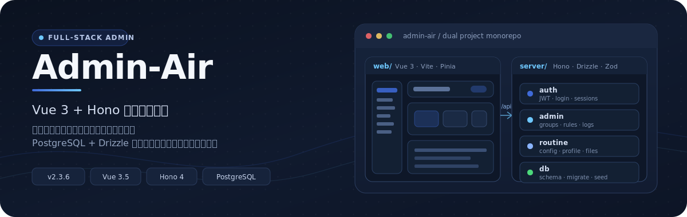
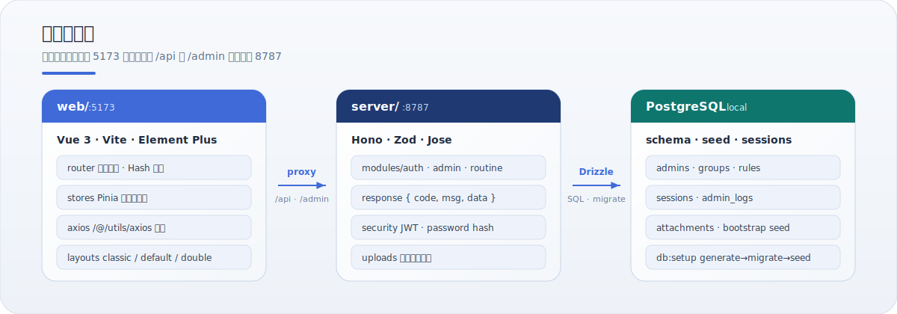
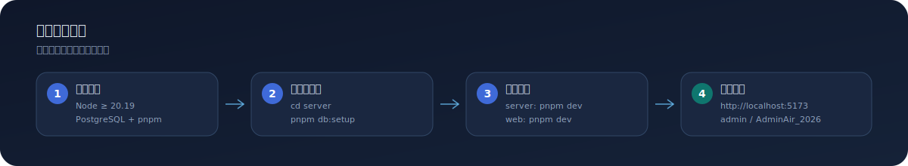

<p align="center">
  
</p>

<p align="center">
  <strong>Admin-Air</strong> · Vue 3 + Hono 全栈管理后台 · v2.3.6
</p>

<p align="center">
  一套可本地跑通的管理后台骨架：权限路由、后台布局、统一 API 契约、PostgreSQL 持久化。
</p>

---

## 它是什么

Admin-Air 是一个**双项目单体仓库**（不是 pnpm workspace）：

| 目录 | 职责 | 栈 |
|------|------|----|
| `web/` | 管理台前端 | Vue 3 · Vite · Pinia · Element Plus · ECharts |
| `server/` | 本地 API 与数据层 | Hono · Drizzle · PostgreSQL · Zod · Jose |
| `docs/` | 人类与代理共用的知识库 | 结构 / 工作流 / 协作约定 |

根目录不提供共享脚本；前端与后端各自 `pnpm install` / `pnpm dev`，只通过 HTTP 协作。

---

## 先看结构

<p align="center">
  
</p>

本地开发默认路径：

1. 浏览器访问 `http://localhost:5173`
2. Vite 把 `/api`、`/admin` 代理到 `http://127.0.0.1:8787`
3. Hono 模块（`auth` / `admin` / `routine`）处理请求
4. Drizzle 读写 PostgreSQL，上传文件走 `/uploads`

---

## 首次启动

<p align="center">
  
</p>

### 环境要求

- Node.js `>= 20.19.0`
- PostgreSQL（本地服务）
- pnpm

### 一、初始化后端

```bash
# Windows 示例：启动 PostgreSQL 服务
Start-Service postgresql-x64-18

cd server
pnpm install
pnpm db:setup    # generate + migrate + seed
pnpm dev         # 默认 :8787
```

### 二、启动前端

```bash
cd web
pnpm install
pnpm dev         # 默认 :5173
```

### 三、登录

| 角色 | 用户名 | 密码 |
|------|--------|------|
| 管理员 | `admin` | `AdminAir_2026` |

访问 [http://localhost:5173](http://localhost:5173)。后端 API 基址为 `http://127.0.0.1:8787`。

日常开发只需在两个终端分别执行 `cd server && pnpm dev` 与 `cd web && pnpm dev`。

---

<p align="center">
  
</p>

### 前端

- **多种后台布局**：`classic` / `default` / `double` / `streamline`
- **权限路由**：无 JWT 时跳转登录；Hash 路由（`createWebHashHistory`）
- **可配置表格与表单**：字段渲染器、远程选择、上传、富文本等
- **状态持久化**：Pinia + `pinia-plugin-persistedstate`
- **全局菜单搜索**：快速定位后台入口

### 后端

- **模块化路由**：`auth` · `admin` · `routine`
- **统一响应**：`{ code, msg, data }`
- **类型安全数据层**：Drizzle schema + 迁移 + seed
- **启动引导数据**：`server/src/bootstrap/bootstrap-data.ts`
- **本地文件服务**：`/uploads/:filename`

---

## 仓库地图

```text
admin-air/
├── web/                 # 前端
│   ├── src/router/      # 路由与鉴权守卫
│   ├── src/stores/      # Pinia
│   ├── src/layouts/     # 后台布局
│   ├── src/components/  # table / baInput / formItem
│   └── src/utils/axios.ts
├── server/              # 后端
│   ├── src/modules/     # auth · admin · routine
│   ├── src/db/          # schema · migrate · seed
│   ├── src/bootstrap/   # 启动数据
│   └── drizzle/         # 迁移文件
├── docs/                # 结构 / 工作流 / 代理协作
├── assets/readme/       # README 视觉资产
├── AGENTS.md            # 代理权威指南（英文）
└── CLAUDE.md            # 次要协作提示
```

更细的入口表见 [`docs/repository-structure.md`](docs/repository-structure.md)。

---

## 常用命令

在 **`web/`** 中：

```bash
pnpm dev          # 开发（会先跑 build 辅助脚本）
pnpm build        # 生产构建
pnpm lint         # ESLint
pnpm typecheck    # vue-tsc
pnpm format       # Prettier
```

在 **`server/`** 中：

```bash
pnpm dev          # 开发（含 PostgreSQL 检测）
pnpm dev:raw      # 跳过检测直接启动
pnpm db:generate  # 生成迁移
pnpm db:migrate   # 执行迁移
pnpm db:seed      # 重置 seed
pnpm db:setup     # generate + migrate + seed
pnpm build        # tsc --noEmit
pnpm start        # 生产启动
```

---

## 关键配置

### 前端（`web/.env*`）

| 变量 | 说明 | 默认 |
|------|------|------|
| `VITE_PORT` | 开发端口 | `5173` |
| `VITE_OPEN` | 启动时打开浏览器 | `true` |
| `VITE_BASE_PATH` | 部署基础路径 | `/` |
| `VITE_OUT_DIR` | 构建输出 | `dist` |

### 后端（`server/.env`）

| 变量 | 说明 | 默认 |
|------|------|------|
| `PORT` | 服务端口 | `8787` |
| `DATABASE_URL` | PostgreSQL 连接串 | — |
| `NODE_ENV` | 运行环境 | `development` |
| `UPLOADS_DIR` | 上传目录 | `./uploads` |

开发库常见约定：用户 `admin_air_dev`，库名 `admin_air`，Windows 服务名 `postgresql-x64-18`。

---

## 约定（写代码前先读）

- **源码优先**：行为以源码与可执行配置为准；`AGENTS.md` 是代理操作权威入口，`docs/` 存持久化上下文。
- **前端**：API 必须走 `web/src/utils/axios.ts`；路径别名 `/@` → `src/`；保持 Composition API + `<script setup>`。
- **后端**：响应保持 `{ code, msg, data }`；持久化用 Drizzle + PostgreSQL，避免临时内存状态。
- **分支**：从 `main` 拉任务分支（建议 `codex/...`），完成后再合回；不要直接在 `main` 上开发。
- **风格**：UTF-8 / LF / 4 空格；Prettier 无分号、单引号、`printWidth: 150`。

完整规则见 [`AGENTS.md`](AGENTS.md) 与 [`docs/development-workflow.md`](docs/development-workflow.md)。

---

## 验证

```bash
# 前端
cd web && pnpm lint && pnpm typecheck && pnpm build

# 后端
cd server && pnpm lint && pnpm build
```

涉及可见 UI、路由/权限或前后端联调时，应再做一次浏览器端到端确认（当前仓库未附带自动化 E2E 套件）。

---

## 文档入口

| 文档 | 用途 |
|------|------|
| [`AGENTS.md`](AGENTS.md) | 代理操作权威指南（英文） |
| [`AGENTS.zh-CN.md`](AGENTS.zh-CN.md) | 中文镜像（以英文版为准） |
| [`docs/index.md`](docs/index.md) | 文档地图 |
| [`docs/repository-structure.md`](docs/repository-structure.md) | 目录与改动入口 |
| [`docs/development-workflow.md`](docs/development-workflow.md) | 命令与交付期望 |
| [`docs/agent-working-guide.md`](docs/agent-working-guide.md) | 文档维护原则 |

建议阅读顺序：`AGENTS.md` → `docs/repository-structure.md` → `docs/development-workflow.md`。

---

## 许可证

私有项目。未经授权不得用于商业用途。

---

<p align="center">
  <sub>Admin-Air · 维护参考日期 2026-07-14</sub>
</p>
